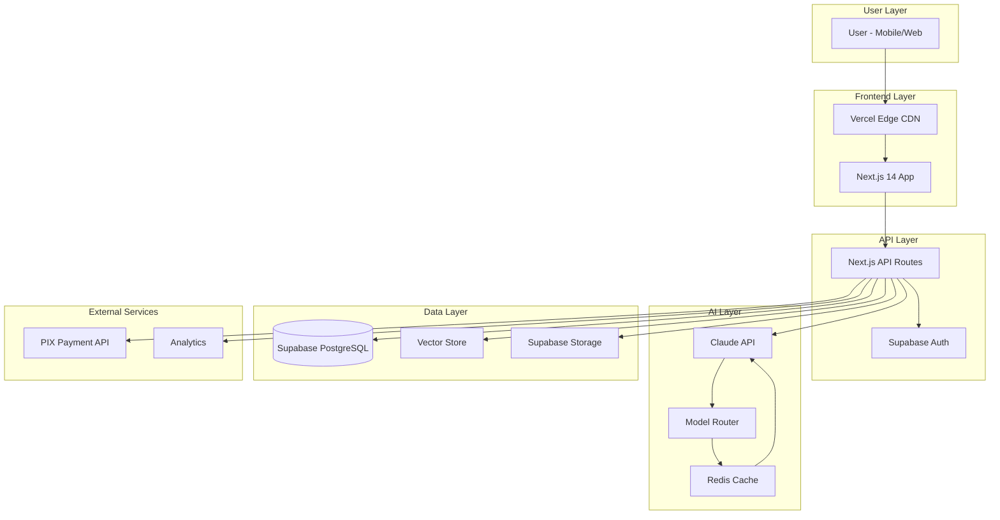
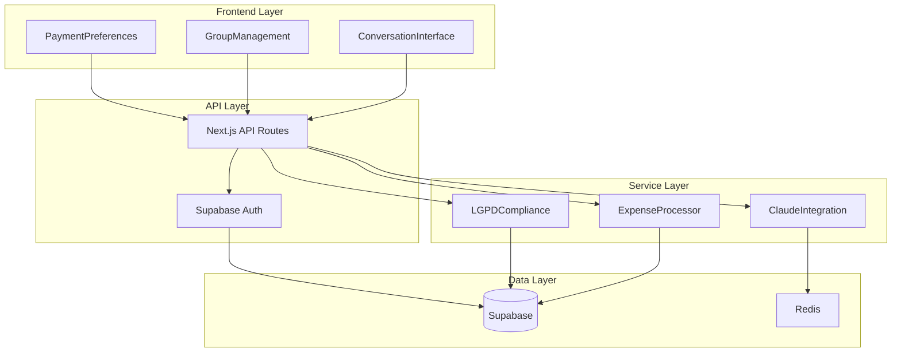
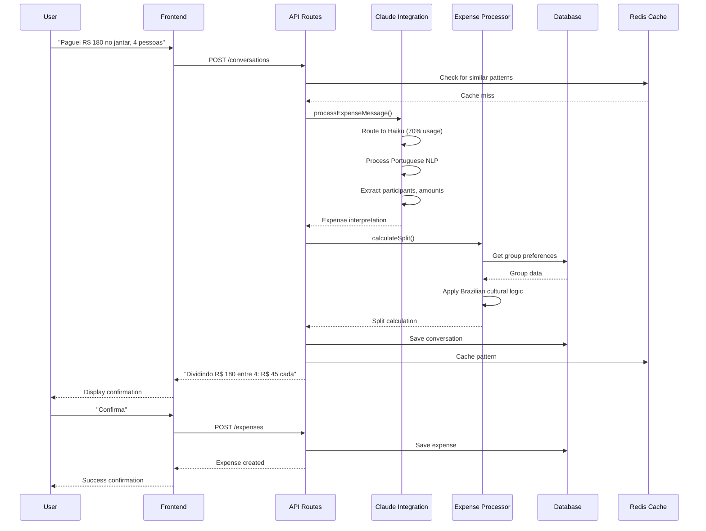
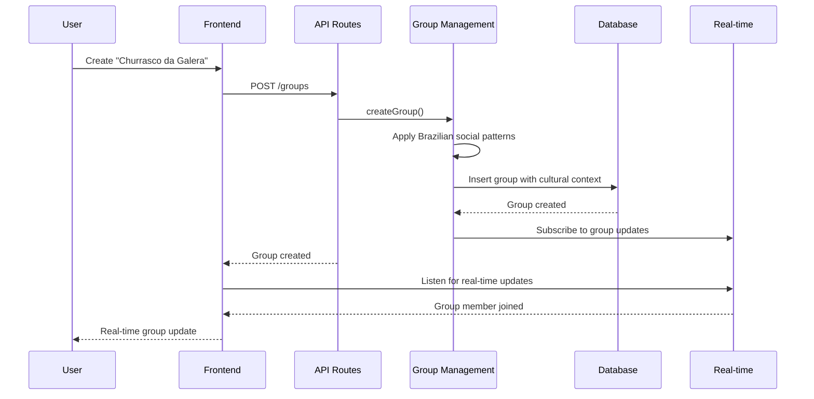

# RachaAI - Brazilian AI-First Bill Splitter
## Complete System Architecture Document

*Generated by Winston - Holistic System Architect*
*Created: December 2024*

---

## 1. Introduction

This document outlines the complete fullstack architecture for **RachaAI**, a Brazilian AI-first bill splitter application that combines Claude AI, Supabase, and Redis to create a conversational expense management experience.

### Project Overview
RachaAI transforms traditional expense splitting into a natural language interface where users describe expenses in Portuguese and Claude AI processes and divides them intelligently, eliminating complex forms and buttons.

### Key Architectural Goals
- **80% reduction in interaction time** vs traditional apps
- **100% LGPD compliance** for Brazilian market
- **Cost-optimized Claude usage** (70% Haiku, 25% Sonnet, 5% Opus)
- **Brazilian cultural adaptation** with Portuguese NLP
- **Real-time conversational UX** with memory retention

---

## 2. High-Level Architecture

### Technical Summary
RachaAI employs a **modern full-stack architecture** with Next.js 14 as the unified framework, featuring server-side rendering and API routes, Tailwind CSS for rapid UI development, Supabase for data persistence and authentication, Redis for session caching and Claude API optimization, and Vercel for deployment with Brazilian edge locations. The system prioritizes Brazilian market requirements with LGPD compliance, Portuguese language support, and cultural context understanding.

### Platform and Infrastructure Choice

**Selected Platform: Vercel + Supabase + Redis Cloud**

**Key Services:**
- **Frontend Hosting:** Vercel (São Paulo region)
- **Database & Auth:** Supabase (São Paulo region)
- **Caching:** Redis Cloud (São Paulo region)
- **AI Provider:** Anthropic Claude API
- **CDN:** Vercel Edge Network

**Deployment Regions:** São Paulo (sa-east-1) for LGPD compliance

### Repository Structure
**Structure:** Monorepo with Nx workspace
**Monorepo Tool:** Nx for build optimization and dependency management
**Package Organization:** Apps (web, api) + Packages (shared, ui, config)

### High-Level Architecture Diagram



### Architectural Patterns

- **Full-Stack Next.js Architecture:** Unified framework with server-side rendering and API routes - *Rationale:* Optimal developer experience and performance for conversational applications
- **Component-Based UI:** Reusable React components with TypeScript and Tailwind CSS - *Rationale:* Maintainability, type safety, and rapid UI development
- **Repository Pattern:** Abstract data access logic - *Rationale:* Enables testing and future database migration flexibility
- **API Gateway Pattern:** Single entry point for all API calls - *Rationale:* Centralized auth, rate limiting, and monitoring
- **Event-Driven Architecture:** Real-time updates via Supabase subscriptions - *Rationale:* Enables live group updates and notifications
- **CQRS Pattern:** Separate read/write models for complex queries - *Rationale:* Optimizes performance for different access patterns

---

## 3. Technology Stack

| Category | Technology | Version | Purpose | Rationale |
|----------|------------|---------|---------|-----------|
| Frontend Language | TypeScript | 5.0+ | Type-safe development | Prevents runtime errors and improves developer experience |
| Full-Stack Framework | Next.js | 14.0+ | Unified React framework | Server-side rendering, API routes, and optimal performance |
| UI Framework | Tailwind CSS | 3.3+ | Utility-first CSS framework | Rapid development and consistent design system |
| State Management | Zustand | 4.4+ | Lightweight state management | Simple, performant, and TypeScript-friendly |
| Backend Language | TypeScript | 5.0+ | Type-safe API development | Shared types between frontend and backend |
| Backend Framework | Next.js API Routes | 14.0+ | Full-stack API endpoints | Unified development experience |
| API Style | REST | - | Standard HTTP APIs | Simple, cacheable, and widely supported |
| Database | Supabase PostgreSQL | 15+ | Primary data store | Built-in auth, real-time subscriptions, and vector support |
| Cache | Redis Cloud | 7.0+ | Session and performance caching | Sub-200ms response times for cached operations |
| File Storage | Supabase Storage | - | User uploads and avatars | Integrated with auth and database |
| Authentication | Supabase Auth | - | User management and sessions | Built-in social logins and Brazilian compliance |
| AI Provider | Anthropic Claude | - | Natural language processing | Advanced Portuguese understanding and cost optimization |
| Frontend Testing | Jest + Testing Library | - | Component and unit testing | Industry standard for React testing |
| Backend Testing | Jest + Supertest | - | API endpoint testing | Comprehensive backend test coverage |
| E2E Testing | Playwright | - | End-to-end user flows | Cross-browser testing with Brazilian scenarios |
| Build Tool | Nx | 17.0+ | Monorepo build system | Optimized builds and dependency management |
| Bundler | Webpack (Next.js) | - | Module bundling | Optimized for Next.js performance |
| CI/CD | GitHub Actions | - | Automated testing and deployment | Integrated with Vercel for seamless deployment |
| Monitoring | Vercel Analytics | - | Performance monitoring | Built-in with deployment platform |
| Logging | Supabase Logs | - | Application logging | Centralized logging with Brazilian compliance |

---

## 4. Data Models

### User Model
**Purpose:** Core user entity with Brazilian market preferences and LGPD compliance

**Key Attributes:**
- `id`: UUID - Primary identifier
- `email`: String - User's email address
- `name`: String - User's display name
- `preferred_payment_method`: String - PIX, Transfer, Cash, etc.
- `pix_key`: String - User's PIX key for easy sharing
- `comfortable_debt_limit`: Decimal - Maximum amount willing to owe
- `language_preference`: String - 'pt-BR' or 'en'
- `lgpd_consent`: Boolean - Explicit consent for data processing
- `created_at`: Timestamp - Account creation date
- `updated_at`: Timestamp - Last profile update

**TypeScript Interface:**
```typescript
interface User {
  id: string;
  email: string;
  name: string;
  preferred_payment_method: 'PIX' | 'TRANSFER' | 'CASH' | 'LATER';
  pix_key?: string;
  comfortable_debt_limit: number;
  language_preference: 'pt-BR' | 'en';
  lgpd_consent: boolean;
  created_at: Date;
  updated_at: Date;
}
```

**Relationships:**
- Has many Groups (as member)
- Has many Expenses (as payer)
- Has many Preferences (as user)

### Group Model
**Purpose:** Expense groups with Brazilian social dynamics and memory retention

**Key Attributes:**
- `id`: UUID - Primary identifier
- `name`: String - Group display name
- `description`: String - Optional group description
- `created_by`: UUID - User who created the group
- `is_active`: Boolean - Whether group is currently active
- `default_split_method`: String - 'EQUAL', 'PROPORTIONAL', 'CUSTOM'
- `cultural_context`: JSON - Brazilian social patterns and preferences
- `created_at`: Timestamp - Group creation date
- `updated_at`: Timestamp - Last group update

**TypeScript Interface:**
```typescript
interface Group {
  id: string;
  name: string;
  description?: string;
  created_by: string;
  is_active: boolean;
  default_split_method: 'EQUAL' | 'PROPORTIONAL' | 'CUSTOM';
  cultural_context: {
    typical_events: string[];
    payment_preferences: Record<string, string>;
    social_patterns: string[];
  };
  created_at: Date;
  updated_at: Date;
}
```

**Relationships:**
- Belongs to User (creator)
- Has many GroupMembers
- Has many Expenses
- Has many GroupPreferences

### Expense Model
**Purpose:** Core expense entity with Claude AI processing and Brazilian context

**Key Attributes:**
- `id`: UUID - Primary identifier
- `group_id`: UUID - Associated group
- `paid_by`: UUID - User who paid
- `amount`: Decimal - Total expense amount in BRL
- `description`: String - Human-readable expense description
- `claude_interpretation`: JSON - Claude's parsed understanding
- `split_details`: JSON - Calculated split information
- `expense_type`: String - 'RESTAURANT', 'TRANSPORT', 'ENTERTAINMENT', etc.
- `currency`: String - Always 'BRL' for Brazilian market
- `status`: String - 'PENDING', 'CONFIRMED', 'SETTLED'
- `created_at`: Timestamp - Expense creation date
- `updated_at`: Timestamp - Last expense update

**TypeScript Interface:**
```typescript
interface Expense {
  id: string;
  group_id: string;
  paid_by: string;
  amount: number;
  description: string;
  claude_interpretation: {
    participants: string[];
    amounts: Record<string, number>;
    discounts: Record<string, number>;
    reasoning: string;
  };
  split_details: {
    total_amount: number;
    per_person: Record<string, number>;
    adjustments: Record<string, number>;
  };
  expense_type: 'RESTAURANT' | 'TRANSPORT' | 'ENTERTAINMENT' | 'SHOPPING' | 'OTHER';
  currency: 'BRL';
  status: 'PENDING' | 'CONFIRMED' | 'SETTLED';
  created_at: Date;
  updated_at: Date;
}
```

**Relationships:**
- Belongs to Group
- Belongs to User (paid_by)
- Has many ExpenseSplits

### Conversation Model
**Purpose:** Claude AI conversation history for context retention and LGPD compliance

**Key Attributes:**
- `id`: UUID - Primary identifier
- `user_id`: UUID - Associated user
- `group_id`: UUID - Associated group (optional)
- `session_id`: String - Conversation session identifier
- `messages`: JSON - Array of conversation messages
- `claude_model_used`: String - Haiku, Sonnet, or Opus
- `tokens_used`: Integer - Token consumption for cost tracking
- `lgpd_retention_date`: Date - When conversation will be deleted
- `created_at`: Timestamp - Conversation start date
- `updated_at`: Timestamp - Last message date

**TypeScript Interface:**
```typescript
interface Conversation {
  id: string;
  user_id: string;
  group_id?: string;
  session_id: string;
  messages: {
    role: 'user' | 'assistant';
    content: string;
    timestamp: Date;
  }[];
  claude_model_used: 'haiku' | 'sonnet' | 'opus';
  tokens_used: number;
  lgpd_retention_date: Date;
  created_at: Date;
  updated_at: Date;
}
```

**Relationships:**
- Belongs to User
- Belongs to Group (optional)

---

## 5. API Specification

### REST API Specification

```yaml
openapi: 3.0.0
info:
  title: RachaAI API
  version: 1.0.0
  description: Brazilian AI-first bill splitter API with Claude integration
servers:
  - url: https://api.rachaai.com.br
    description: Production API
  - url: https://api-staging.rachaai.com.br
    description: Staging API
  - url: http://localhost:3000/api
    description: Local development

paths:
  /auth:
    post:
      summary: Authenticate user
      requestBody:
        required: true
        content:
          application/json:
            schema:
              type: object
              properties:
                email:
                  type: string
                password:
                  type: string
      responses:
        '200':
          description: Authentication successful
          content:
            application/json:
              schema:
                $ref: '#/components/schemas/AuthResponse'

  /conversations:
    post:
      summary: Start new conversation with Claude
      security:
        - BearerAuth: []
      requestBody:
        required: true
        content:
          application/json:
            schema:
              type: object
              properties:
                message:
                  type: string
                  description: User's natural language expense description
                group_id:
                  type: string
                  format: uuid
                  description: Optional group context
      responses:
        '200':
          description: Claude response with expense interpretation
          content:
            application/json:
              schema:
                $ref: '#/components/schemas/ConversationResponse'

  /expenses:
    post:
      summary: Create new expense
      security:
        - BearerAuth: []
      requestBody:
        required: true
        content:
          application/json:
            schema:
              $ref: '#/components/schemas/ExpenseCreate'
      responses:
        '201':
          description: Expense created successfully
          content:
            application/json:
              schema:
                $ref: '#/components/schemas/Expense'

  /groups:
    get:
      summary: Get user's groups
      security:
        - BearerAuth: []
      responses:
        '200':
          description: List of user's groups
          content:
            application/json:
              schema:
                type: array
                items:
                  $ref: '#/components/schemas/Group'

components:
  schemas:
    AuthResponse:
      type: object
      properties:
        user:
          $ref: '#/components/schemas/User'
        token:
          type: string
        refresh_token:
          type: string

    ConversationResponse:
      type: object
      properties:
        message:
          type: string
          description: Claude's response
        expense_interpretation:
          $ref: '#/components/schemas/ExpenseInterpretation'
        suggested_actions:
          type: array
          items:
            type: string

    ExpenseInterpretation:
      type: object
      properties:
        participants:
          type: array
          items:
            type: string
        amounts:
          type: object
          additionalProperties:
            type: number
        discounts:
          type: object
          additionalProperties:
            type: number
        reasoning:
          type: string

    ExpenseCreate:
      type: object
      required:
        - group_id
        - amount
        - description
      properties:
        group_id:
          type: string
          format: uuid
        amount:
          type: number
          minimum: 0
        description:
          type: string
        claude_interpretation:
          $ref: '#/components/schemas/ExpenseInterpretation'

  securitySchemes:
    BearerAuth:
      type: http
      scheme: bearer
      bearerFormat: JWT
```

---

## 6. Components

### Frontend Components

**ConversationInterface Component**
**Responsibility:** Main conversational UI for expense input and Claude responses
**Key Interfaces:**
- `onMessageSend(message: string)`
- `onExpenseConfirm(expense: Expense)`
- `onExpenseEdit(expense: Expense)`
**Dependencies:** Claude API service, Expense service, User context
**Technology Stack:** React + TypeScript + Tailwind CSS

**GroupManagement Component**
**Responsibility:** Group creation, member management, and Brazilian social patterns
**Key Interfaces:**
- `onGroupCreate(group: Group)`
- `onMemberAdd(userId: string)`
- `onPreferenceUpdate(preferences: GroupPreferences)`
**Dependencies:** Group service, User service, Supabase real-time
**Technology Stack:** React + Supabase client + Real-time subscriptions

**PaymentPreferences Component**
**Responsibility:** Brazilian payment method management (PIX, transfers, etc.)
**Key Interfaces:**
- `onPixKeyUpdate(key: string)`
- `onPaymentMethodChange(method: PaymentMethod)`
- `onDebtLimitUpdate(limit: number)`
**Dependencies:** User service, Payment service
**Technology Stack:** React + TypeScript + Brazilian payment APIs

### Backend Components

**ClaudeIntegration Service**
**Responsibility:** Intelligent model routing and Portuguese NLP processing
**Key Interfaces:**
- `processExpenseMessage(message: string, context: ConversationContext)`
- `routeToOptimalModel(complexity: ComplexityLevel)`
- `validateBrazilianContext(context: BrazilianContext)`
**Dependencies:** Anthropic API, Redis cache, Model router
**Technology Stack:** TypeScript + Claude API + Redis caching

**ExpenseProcessor Service**
**Responsibility:** Expense calculation and split logic with Brazilian cultural awareness
**Key Interfaces:**
- `calculateSplit(expense: Expense, group: Group)`
- `applyBrazilianDiscounts(expense: Expense)`
- `validatePaymentPreferences(expense: Expense)`
**Dependencies:** Group service, User service, Payment service
**Technology Stack:** TypeScript + Mathematical calculations + Cultural logic

**LGPDCompliance Service**
**Responsibility:** Brazilian data protection compliance and user rights management
**Key Interfaces:**
- `validateConsent(userId: string, action: string)`
- `processDataRequest(userId: string, requestType: DataRequestType)`
- `scheduleDataDeletion(userId: string, retentionPeriod: number)`
**Dependencies:** User service, Database service, Audit service
**Technology Stack:** TypeScript + LGPD compliance logic + Audit logging

### Component Diagram



---

## 7. Core Workflows

### Primary Expense Processing Workflow



### Group Creation with Brazilian Context



---

## 8. Database Schema

### Core Tables

```sql
-- Users table with Brazilian market preferences
CREATE TABLE users (
    id UUID PRIMARY KEY DEFAULT gen_random_uuid(),
    email VARCHAR(255) UNIQUE NOT NULL,
    name VARCHAR(255) NOT NULL,
    preferred_payment_method VARCHAR(50) DEFAULT 'PIX',
    pix_key VARCHAR(255),
    comfortable_debt_limit DECIMAL(10,2) DEFAULT 0,
    language_preference VARCHAR(10) DEFAULT 'pt-BR',
    lgpd_consent BOOLEAN DEFAULT FALSE,
    created_at TIMESTAMP WITH TIME ZONE DEFAULT NOW(),
    updated_at TIMESTAMP WITH TIME ZONE DEFAULT NOW()
);

-- Groups with Brazilian cultural context
CREATE TABLE groups (
    id UUID PRIMARY KEY DEFAULT gen_random_uuid(),
    name VARCHAR(255) NOT NULL,
    description TEXT,
    created_by UUID REFERENCES users(id),
    is_active BOOLEAN DEFAULT TRUE,
    default_split_method VARCHAR(50) DEFAULT 'EQUAL',
    cultural_context JSONB DEFAULT '{}',
    created_at TIMESTAMP WITH TIME ZONE DEFAULT NOW(),
    updated_at TIMESTAMP WITH TIME ZONE DEFAULT NOW()
);

-- Group members with Brazilian social dynamics
CREATE TABLE group_members (
    id UUID PRIMARY KEY DEFAULT gen_random_uuid(),
    group_id UUID REFERENCES groups(id) ON DELETE CASCADE,
    user_id UUID REFERENCES users(id) ON DELETE CASCADE,
    role VARCHAR(50) DEFAULT 'MEMBER',
    payment_preferences JSONB DEFAULT '{}',
    social_patterns JSONB DEFAULT '[]',
    created_at TIMESTAMP WITH TIME ZONE DEFAULT NOW(),
    UNIQUE(group_id, user_id)
);

-- Expenses with Claude AI interpretation
CREATE TABLE expenses (
    id UUID PRIMARY KEY DEFAULT gen_random_uuid(),
    group_id UUID REFERENCES groups(id) ON DELETE CASCADE,
    paid_by UUID REFERENCES users(id),
    amount DECIMAL(10,2) NOT NULL,
    description TEXT NOT NULL,
    claude_interpretation JSONB NOT NULL,
    split_details JSONB NOT NULL,
    expense_type VARCHAR(50) DEFAULT 'OTHER',
    currency VARCHAR(3) DEFAULT 'BRL',
    status VARCHAR(50) DEFAULT 'PENDING',
    created_at TIMESTAMP WITH TIME ZONE DEFAULT NOW(),
    updated_at TIMESTAMP WITH TIME ZONE DEFAULT NOW()
);

-- Conversations for LGPD compliance
CREATE TABLE conversations (
    id UUID PRIMARY KEY DEFAULT gen_random_uuid(),
    user_id UUID REFERENCES users(id) ON DELETE CASCADE,
    group_id UUID REFERENCES groups(id) ON DELETE CASCADE,
    session_id VARCHAR(255) NOT NULL,
    messages JSONB NOT NULL DEFAULT '[]',
    claude_model_used VARCHAR(50) NOT NULL,
    tokens_used INTEGER DEFAULT 0,
    lgpd_retention_date DATE NOT NULL,
    created_at TIMESTAMP WITH TIME ZONE DEFAULT NOW(),
    updated_at TIMESTAMP WITH TIME ZONE DEFAULT NOW()
);

-- Brazilian payment preferences
CREATE TABLE payment_preferences (
    id UUID PRIMARY KEY DEFAULT gen_random_uuid(),
    user_id UUID REFERENCES users(id) ON DELETE CASCADE,
    group_id UUID REFERENCES groups(id) ON DELETE CASCADE,
    payment_method VARCHAR(50) NOT NULL,
    pix_key VARCHAR(255),
    bank_info JSONB,
    comfortable_limit DECIMAL(10,2),
    created_at TIMESTAMP WITH TIME ZONE DEFAULT NOW()
);

-- Indexes for performance
CREATE INDEX idx_expenses_group_id ON expenses(group_id);
CREATE INDEX idx_expenses_paid_by ON expenses(paid_by);
CREATE INDEX idx_conversations_user_id ON conversations(user_id);
CREATE INDEX idx_conversations_retention ON conversations(lgpd_retention_date);
CREATE INDEX idx_group_members_group_id ON group_members(group_id);
CREATE INDEX idx_payment_preferences_user_id ON payment_preferences(user_id);

-- Vector store for semantic search
CREATE EXTENSION IF NOT EXISTS vector;
CREATE TABLE expense_embeddings (
    id UUID PRIMARY KEY DEFAULT gen_random_uuid(),
    expense_id UUID REFERENCES expenses(id) ON DELETE CASCADE,
    embedding vector(1536),
    created_at TIMESTAMP WITH TIME ZONE DEFAULT NOW()
);
```

---

## 9. Frontend Architecture

### Component Organization

```
src/
├── components/
│   ├── conversation/
│   │   ├── ConversationInterface.tsx
│   │   ├── MessageBubble.tsx
│   │   └── ExpenseConfirmation.tsx
│   ├── groups/
│   │   ├── GroupManagement.tsx
│   │   ├── GroupCard.tsx
│   │   └── MemberList.tsx
│   ├── payments/
│   │   ├── PaymentPreferences.tsx
│   │   ├── PixKeyInput.tsx
│   │   └── PaymentMethodSelector.tsx
│   ├── common/
│   │   ├── Button.tsx
│   │   ├── Input.tsx
│   │   └── Modal.tsx
│   └── layout/
│       ├── Header.tsx
│       ├── Sidebar.tsx
│       └── Footer.tsx
├── hooks/
│   ├── useConversation.ts
│   ├── useGroups.ts
│   ├── useExpenses.ts
│   └── useAuth.ts
├── services/
│   ├── claudeService.ts
│   ├── expenseService.ts
│   ├── groupService.ts
│   └── authService.ts
├── stores/
│   ├── conversationStore.ts
│   ├── groupStore.ts
│   └── userStore.ts
├── types/
│   ├── conversation.ts
│   ├── expense.ts
│   ├── group.ts
│   └── user.ts
└── utils/
    ├── brazilianUtils.ts
    ├── currencyUtils.ts
    └── lgpdUtils.ts
```

### State Management Architecture

```typescript
// Conversation Store (Zustand)
interface ConversationStore {
  messages: Message[];
  currentExpense: Expense | null;
  isLoading: boolean;
  error: string | null;
  
  // Actions
  sendMessage: (message: string) => Promise<void>;
  confirmExpense: (expense: Expense) => Promise<void>;
  editExpense: (expense: Expense) => Promise<void>;
  clearConversation: () => void;
}

// Group Store
interface GroupStore {
  groups: Group[];
  currentGroup: Group | null;
  members: GroupMember[];
  
  // Actions
  createGroup: (group: GroupCreate) => Promise<void>;
  addMember: (groupId: string, userId: string) => Promise<void>;
  updatePreferences: (groupId: string, preferences: GroupPreferences) => Promise<void>;
}

// User Store
interface UserStore {
  user: User | null;
  preferences: PaymentPreferences;
  
  // Actions
  updatePaymentMethod: (method: PaymentMethod) => Promise<void>;
  updatePixKey: (key: string) => Promise<void>;
  updateDebtLimit: (limit: number) => Promise<void>;
}
```

### Routing Architecture

```
/                           # Landing page
/login                      # Authentication
/dashboard                  # Main app dashboard
/conversation               # Main conversation interface
/groups                     # Group management
/groups/[id]               # Specific group view
/expenses                   # Expense history
/profile                    # User profile and preferences
/settings                   # App settings
/lgpd                       # LGPD compliance dashboard
```

---

## 10. Backend Architecture

### API Routes Organization

```
pages/api/
├── auth/
│   ├── login.ts
│   ├── register.ts
│   └── logout.ts
├── conversations/
│   ├── index.ts           # POST - Start conversation
│   └── [id].ts           # GET/PUT - Manage conversation
├── expenses/
│   ├── index.ts           # GET/POST - List/Create expenses
│   └── [id].ts           # GET/PUT/DELETE - Manage expense
├── groups/
│   ├── index.ts           # GET/POST - List/Create groups
│   └── [id]/
│       ├── index.ts       # GET/PUT/DELETE - Manage group
│       ├── members.ts     # GET/POST - Manage members
│       └── expenses.ts    # GET - Group expenses
├── users/
│   ├── profile.ts         # GET/PUT - User profile
│   └── preferences.ts     # GET/PUT - Payment preferences
├── claude/
│   ├── process.ts         # POST - Process message with Claude
│   └── models.ts          # GET - Available models
└── lgpd/
    ├── consent.ts         # POST - Update consent
    ├── export.ts          # GET - Export user data
    └── delete.ts          # DELETE - Delete user data
```

### Service Layer Architecture

```typescript
// Claude Integration Service
class ClaudeService {
  private modelRouter: ModelRouter;
  private cache: RedisCache;
  
  async processMessage(message: string, context: ConversationContext): Promise<ClaudeResponse> {
    const complexity = this.analyzeComplexity(message);
    const model = this.modelRouter.routeToModel(complexity);
    
    const cached = await this.cache.get(`conversation:${context.sessionId}`);
    if (cached) return cached;
    
    const response = await this.callClaude(message, model, context);
    await this.cache.set(`conversation:${context.sessionId}`, response, 900);
    
    return response;
  }
  
  private analyzeComplexity(message: string): ComplexityLevel {
    // Analyze Portuguese text complexity
    const wordCount = message.split(' ').length;
    const hasComplexLogic = this.detectComplexLogic(message);
    const hasBrazilianContext = this.detectBrazilianContext(message);
    
    if (wordCount > 50 || hasComplexLogic) return 'HIGH';
    if (hasBrazilianContext || wordCount > 20) return 'MEDIUM';
    return 'LOW';
  }
}

// Expense Processor Service
class ExpenseProcessor {
  async calculateSplit(expense: Expense, group: Group): Promise<SplitResult> {
    const participants = this.extractParticipants(expense.description);
    const amounts = this.extractAmounts(expense.description);
    const discounts = this.extractBrazilianDiscounts(expense.description);
    
    const baseAmount = expense.amount;
    const adjustedAmount = this.applyDiscounts(baseAmount, discounts);
    
    return this.distributeAmount(adjustedAmount, participants, group.default_split_method);
  }
  
  private extractBrazilianDiscounts(description: string): Discount[] {
    // Extract Brazilian-specific discounts like "Maria só bebeu água"
    const patterns = [
      /(\w+)\s+só\s+(bebeu|comeu)\s+(\w+)/i,
      /(\w+)\s+não\s+(comeu|bebeu)/i,
      /desconto\s+de\s+R?\$?\s*(\d+)/i
    ];
    
    return patterns.map(pattern => {
      const match = description.match(pattern);
      if (match) {
        return {
          person: match[1],
          reason: match[2] || 'discount',
          amount: parseFloat(match[3] || '0')
        };
      }
    }).filter(Boolean);
  }
}

// LGPD Compliance Service
class LGPDComplianceService {
  async validateConsent(userId: string, action: string): Promise<boolean> {
    const user = await this.getUser(userId);
    return user.lgpd_consent && this.isActionAllowed(action);
  }
  
  async processDataRequest(userId: string, requestType: DataRequestType): Promise<void> {
    switch (requestType) {
      case 'EXPORT':
        return this.exportUserData(userId);
      case 'DELETE':
        return this.scheduleUserDeletion(userId);
      case 'CORRECT':
        return this.correctUserData(userId);
    }
  }
  
  private async scheduleUserDeletion(userId: string): Promise<void> {
    const retentionDate = new Date();
    retentionDate.setDate(retentionDate.getDate() + 90); // 90 days retention
    
    await this.db.conversations.updateMany(
      { user_id: userId },
      { lgpd_retention_date: retentionDate }
    );
  }
}
```

---

## 11. Security and Performance

### Security Requirements

**Frontend Security:**
- CSP Headers: `default-src 'self'; script-src 'self' 'unsafe-inline' 'unsafe-eval'; style-src 'self' 'unsafe-inline';`
- XSS Prevention: Content Security Policy + input sanitization
- Secure Storage: Encrypted localStorage for sensitive data

**Backend Security:**
- Input Validation: Joi schema validation for all API inputs
- Rate Limiting: 100 requests/min per user, 10 Claude calls/min
- CORS Policy: Restricted to RachaAI domains only

**Authentication Security:**
- Token Storage: HttpOnly cookies with secure flags
- Session Management: JWT with 7-day TTL + refresh tokens
- Password Policy: Minimum 8 characters, complexity requirements

### Performance Optimization

**Frontend Performance:**
- Bundle Size Target: <500KB initial load
- Loading Strategy: Code splitting by routes and components
- Caching Strategy: Service Worker for static assets

**Backend Performance:**
- Response Time Target: <1s for Haiku, <2.5s for Sonnet
- Database Optimization: Indexed queries, connection pooling
- Caching Strategy: Redis for session data and Claude responses

**Claude API Optimization:**
- Model Routing: 70% Haiku, 25% Sonnet, 5% Opus
- Context Minimization: Send only essential context
- Batch Processing: Group multiple validations in single request
- Cache-First: Redis lookup before Claude calls

---

## 12. Deployment Architecture

### Deployment Strategy

**Frontend Deployment:**
- Platform: Vercel (São Paulo region)
- Build Command: `npm run build`
- Output Directory: `.next`
- CDN/Edge: Vercel Edge Network with Brazilian edge locations

**Backend Deployment:**
- Platform: Vercel Serverless Functions
- Build Command: `npm run build`
- Deployment Method: Git-based automatic deployment

### Environment Configuration

```bash
# Frontend (.env.local)
NEXT_PUBLIC_SUPABASE_URL=https://your-project.supabase.co
NEXT_PUBLIC_SUPABASE_ANON_KEY=your-anon-key
NEXT_PUBLIC_CLAUDE_API_URL=https://api.anthropic.com
NEXT_PUBLIC_APP_URL=https://rachaai.com.br

# Backend (.env)
CLAUDE_API_KEY=your-claude-api-key
REDIS_URL=your-redis-url
SUPABASE_SERVICE_ROLE_KEY=your-service-role-key
LGPD_RETENTION_DAYS=90
BRAZILIAN_REGION=sa-east-1
```

### CI/CD Pipeline

```yaml
name: RachaAI CI/CD
on:
  push:
    branches: [main, develop]
  pull_request:
    branches: [main]

jobs:
  test:
    runs-on: ubuntu-latest
    steps:
      - uses: actions/checkout@v3
      - uses: actions/setup-node@v3
        with:
          node-version: '18'
      - run: npm ci
      - run: npm run test
      - run: npm run test:e2e

  deploy:
    needs: test
    runs-on: ubuntu-latest
    if: github.ref == 'refs/heads/main'
    steps:
      - uses: actions/checkout@v3
      - uses: amondnet/vercel-action@v25
        with:
          vercel-token: ${{ secrets.VERCEL_TOKEN }}
          vercel-org-id: ${{ secrets.ORG_ID }}
          vercel-project-id: ${{ secrets.PROJECT_ID }}
          vercel-args: '--prod'
```

---

## 13. Monitoring and Observability

### Monitoring Stack
- **Frontend Monitoring:** Vercel Analytics + Sentry
- **Backend Monitoring:** Vercel Functions monitoring
- **Error Tracking:** Sentry with Brazilian context
- **Performance Monitoring:** Core Web Vitals + API response times

### Key Metrics

**Frontend Metrics:**
- Core Web Vitals (LCP, FID, CLS)
- JavaScript errors and performance
- API response times
- User interactions and conversion rates

**Backend Metrics:**
- Request rate and error rate
- Claude API response times and costs
- Database query performance
- Redis cache hit rates

**Business Metrics:**
- Daily active users (Brazilian timezone)
- Conversation success rate (>95% target)
- Cost per interaction (<R$ 0.80 target)
- Portuguese vs English usage ratio

---

## 14. Development Workflow

### Local Development Setup

```bash
# Prerequisites
node 18+
npm 9+
Redis (local or cloud)
Supabase CLI

# Initial Setup
git clone https://github.com/your-org/rachaai.git
cd rachaai
npm install
cp .env.example .env.local
npm run dev

# Development Commands
npm run dev          # Start all services
npm run dev:frontend # Start frontend only
npm run dev:backend  # Start backend only
npm run test         # Run all tests
npm run test:e2e     # Run E2E tests
npm run build        # Build for production
```

### Environment Configuration

```bash
# Required Environment Variables
NEXT_PUBLIC_SUPABASE_URL=https://your-project.supabase.co
NEXT_PUBLIC_SUPABASE_ANON_KEY=your-anon-key
CLAUDE_API_KEY=your-claude-api-key
REDIS_URL=your-redis-url
SUPABASE_SERVICE_ROLE_KEY=your-service-role-key
LGPD_RETENTION_DAYS=90
BRAZILIAN_REGION=sa-east-1
```

---

## 15. Critical Fullstack Rules

- **Type Sharing:** Always define types in packages/shared and import from there
- **API Calls:** Never make direct HTTP calls - use the service layer
- **Environment Variables:** Access only through config objects, never process.env directly
- **Error Handling:** All API routes must use the standard error handler
- **State Updates:** Never mutate state directly - use proper state management patterns
- **Brazilian Context:** Always validate Brazilian cultural patterns and LGPD compliance
- **Claude Optimization:** Route to appropriate model based on complexity analysis
- **Caching Strategy:** Always check Redis cache before making Claude API calls
- **Security First:** Validate all user inputs and implement proper authentication
- **Performance Focus:** Optimize for Brazilian mobile users and 4G/5G networks

---

## Summary

This architecture document provides a comprehensive foundation for RachaAI, focusing on Brazilian market requirements, LGPD compliance, and cost-optimized Claude AI integration. The system is designed for rapid development with Next.js full-stack framework, scalable deployment on Vercel, and intelligent caching with Redis.

**Key Architectural Decisions:**
- ✅ Full-stack Next.js architecture for unified development experience
- ✅ Tailwind CSS for rapid UI development and consistent design
- ✅ Claude model routing (70/25/5) for cost optimization
- ✅ Brazilian hosting (São Paulo) for LGPD compliance
- ✅ Real-time updates via Supabase subscriptions
- ✅ Comprehensive LGPD compliance implementation
- ✅ Portuguese NLP optimization for Brazilian market

**Next Steps:**
1. Review and approve architecture document
2. Set up development environment
3. Begin Story 1: Basic Claude integration
4. Implement core components following this architecture 