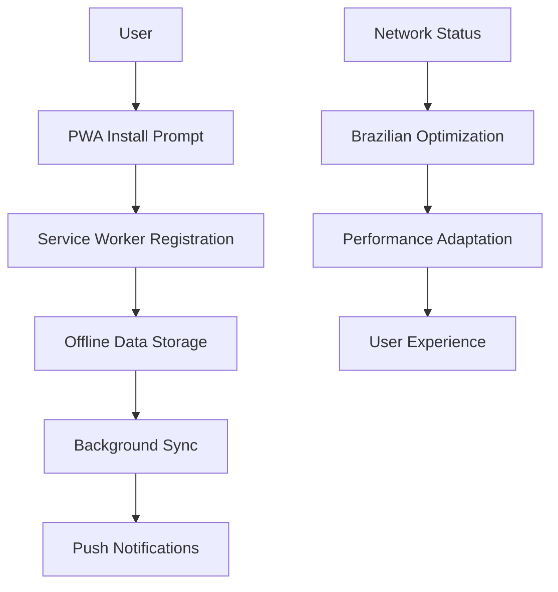

# RachaAI PWA Implementation Guide

## Story 17: Progressive Web App & Offline Support

This document provides a comprehensive guide to the PWA implementation for RachaAI, including installation, offline functionality, push notifications, and Brazilian market optimizations.

---

## Table of Contents

1. [Overview](#overview)
2. [Architecture](#architecture)
3. [Installation & Setup](#installation--setup)
4. [Components](#components)
5. [Hooks](#hooks)
6. [API Endpoints](#api-endpoints)
7. [Testing](#testing)
8. [Brazilian Market Optimizations](#brazilian-market-optimizations)
9. [Performance Considerations](#performance-considerations)
10. [Troubleshooting](#troubleshooting)

---

## Overview

The RachaAI PWA provides a native app-like experience with offline functionality, push notifications, and Brazilian market optimizations. Key features include:

- **PWA Installation**: Easy installation on mobile devices
- **Offline Expense Tracking**: Add and manage expenses without internet
- **Push Notifications**: Brazilian cultural notifications and payment reminders
- **Network Optimization**: Adaptive performance based on Brazilian network conditions
- **Service Worker**: Intelligent caching and background sync

---

## Architecture

### Core Components

```
PWA Implementation
├── lib/pwa-hooks.ts              # React hooks for PWA functionality
├── components/PWAInstallPrompt.tsx # Installation prompts and UI
├── components/OfflineExpenseTracker.tsx # Offline expense management
├── components/PushNotificationManager.tsx # Push notification management
├── pages/pwa-test.tsx            # Comprehensive test page
├── pages/api/push/               # Push notification API endpoints
├── public/sw.js                  # Service worker implementation
└── public/manifest.json          # PWA manifest configuration
```

### Data Flow



---

## Installation & Setup

### Prerequisites

1. **Environment Variables**
   ```bash
   # Add to .env.local
   NEXT_PUBLIC_VAPID_PUBLIC_KEY=your_vapid_public_key
   VAPID_PRIVATE_KEY=your_vapid_private_key
   ```

2. **Dependencies**
   ```bash
   npm install web-push @types/web-push --legacy-peer-deps
   ```

3. **VAPID Keys Generation**
   ```bash
   # Generate VAPID keys for push notifications
   npx web-push generate-vapid-keys
   ```

### Configuration

1. **Next.js Configuration** (`next.config.js`)
   ```javascript
   const withPWA = require('next-pwa')({
     dest: 'public',
     register: true,
     skipWaiting: true,
     disable: process.env.NODE_ENV === 'development',
     runtimeCaching: [
       // ... caching configuration
     ],
   });
   ```

2. **Service Worker** (`public/sw.js`)
   - Handles offline functionality
   - Manages caching strategies
   - Processes push notifications
   - Implements background sync

3. **Manifest** (`public/manifest.json`)
   - PWA installation configuration
   - Brazilian market optimizations
   - App icons and shortcuts

---

## Components

### PWAInstallPrompt

**Purpose**: Provides installation prompts and PWA status indicators.

**Usage**:
```tsx
import PWAInstallPrompt, { FloatingInstallButton, PWAStatusIndicator } from '../components/PWAInstallPrompt';

// Automatic installation prompt
<PWAInstallPrompt 
  showOnMobile={true}
  showOnDesktop={false}
  autoShow={true}
  delay={5000}
/>

// Floating install button
<FloatingInstallButton />

// Status indicator
<PWAStatusIndicator />
```

**Features**:
- Automatic installation prompts
- Brazilian cultural context
- Installation status tracking
- Floating action button

### OfflineExpenseTracker

**Purpose**: Manages offline expense tracking and synchronization.

**Usage**:
```tsx
import OfflineExpenseTracker from '../components/OfflineExpenseTracker';

<OfflineExpenseTracker
  userId="user-123"
  onExpenseAdded={(expense) => console.log('Expense added:', expense)}
  onSyncComplete={(count) => console.log('Synced:', count)}
/>
```

**Features**:
- Offline expense creation
- Local storage management
- Background synchronization
- Brazilian expense categories
- Network status awareness

### PushNotificationManager

**Purpose**: Handles push notification permissions and settings.

**Usage**:
```tsx
import PushNotificationManager from '../components/PushNotificationManager';

<PushNotificationManager
  userId="user-123"
  onNotificationSent={(notification) => console.log('Notification sent:', notification)}
/>
```

**Features**:
- Permission management
- Brazilian cultural notifications
- Payment reminders
- Holiday notifications
- Settings customization

---

## Hooks

### usePWAInstallation

**Purpose**: Manages PWA installation state and process.

**Usage**:
```tsx
import { usePWAInstallation } from '../lib/pwa-hooks';

const { isInstallable, isInstalled, installPWA } = usePWAInstallation();

if (isInstallable && !isInstalled) {
  // Show installation prompt
}
```

### useOfflineData

**Purpose**: Manages offline data storage and synchronization.

**Usage**:
```tsx
import { useOfflineData } from '../lib/pwa-hooks';

const { offlineData, addOfflineExpense, syncOfflineData } = useOfflineData();

// Add offline expense
await addOfflineExpense({
  title: 'Jantar',
  amount: 50.00,
  participants: ['João', 'Maria'],
  category: 'Restaurante',
});
```

### useNetworkStatus

**Purpose**: Monitors network connectivity and quality.

**Usage**:
```tsx
import { useNetworkStatus } from '../lib/pwa-hooks';

const networkStatus = useNetworkStatus();

console.log('Online:', networkStatus.isOnline);
console.log('Connection type:', networkStatus.connectionType);
console.log('Effective type:', networkStatus.effectiveType);
```

### useBrazilianNetworkOptimization

**Purpose**: Provides network optimization settings for Brazilian conditions.

**Usage**:
```tsx
import { useBrazilianNetworkOptimization } from '../lib/pwa-hooks';

const { optimizationSettings } = useBrazilianNetworkOptimization();

if (optimizationSettings.enableOfflineMode) {
  // Enable offline features
}
```

### usePushNotifications

**Purpose**: Manages push notification subscriptions and permissions.

**Usage**:
```tsx
import { usePushNotifications } from '../lib/pwa-hooks';

const { isSupported, permission, requestPermission, subscribeToPush } = usePushNotifications();

if (isSupported && permission === 'default') {
  await requestPermission();
  await subscribeToPush();
}
```

---

## API Endpoints

### POST /api/push/subscribe

**Purpose**: Handles push notification subscriptions.

**Request**:
```json
{
  "subscription": {
    "endpoint": "https://fcm.googleapis.com/fcm/send/...",
    "keys": {
      "p256dh": "...",
      "auth": "..."
    }
  },
  "userId": "user-123"
}
```

**Response**:
```json
{
  "success": true,
  "message": "Subscription successful",
  "subscription": "https://fcm.googleapis.com/fcm/send/..."
}
```

### POST /api/push/unsubscribe

**Purpose**: Handles push notification unsubscriptions.

**Request**:
```json
{
  "subscription": {
    "endpoint": "https://fcm.googleapis.com/fcm/send/...",
    "keys": {
      "p256dh": "...",
      "auth": "..."
    }
  },
  "userId": "user-123"
}
```

### POST /api/push/send-test

**Purpose**: Sends test push notifications.

**Request**:
```json
{
  "subscription": {
    "endpoint": "https://fcm.googleapis.com/fcm/send/...",
    "keys": {
      "p256dh": "...",
      "auth": "..."
    }
  },
  "settings": {
    "paymentReminders": true,
    "groupUpdates": true
  }
}
```

---

## Testing

### Running Tests

```bash
# Run PWA tests
npm test -- pwa-functionality.test.ts

# Run with coverage
npm test -- --coverage pwa-functionality.test.ts
```

### Test Coverage

The PWA tests cover:
- Installation prompts and flows
- Offline data management
- Push notification permissions
- Network status monitoring
- Brazilian optimizations
- Service worker functionality

### Manual Testing

1. **PWA Installation**
   - Visit `/pwa-test` on mobile device
   - Test installation prompt
   - Verify app installation

2. **Offline Functionality**
   - Disconnect internet
   - Add offline expenses
   - Reconnect and test sync

3. **Push Notifications**
   - Grant notification permissions
   - Test notification delivery
   - Verify Brazilian cultural content

---

## Brazilian Market Optimizations

### Network Optimization

**Slow Networks (2G/3G)**:
- Reduce image quality
- Use faster AI models
- Enable aggressive caching
- Disable animations

**Good Networks (4G/5G)**:
- Full quality images
- Advanced AI models
- Standard caching
- Smooth animations

### Cultural Adaptations

**Notifications**:
- Brazilian Portuguese language
- Cultural event reminders
- Holiday notifications
- Payment method preferences

**Expense Categories**:
- Restaurante
- Bar/Happy Hour
- Churrasco
- Festa
- Viagem

**Payment Methods**:
- PIX integration
- Boleto support
- Credit card options
- Cash tracking

### Performance Targets

- **PWA Load Time**: <3 seconds on Brazilian networks
- **Offline Functionality**: 100% core features available
- **Service Worker**: <1 second for cached content
- **Push Notifications**: <5 seconds for delivery
- **Mobile Performance**: >90 Lighthouse score

---

## Performance Considerations

### Caching Strategy

1. **Static Assets**
   - Cache images, CSS, JS files
   - Use CacheFirst strategy
   - 30-day expiration

2. **API Responses**
   - Cache Claude API responses
   - Use NetworkFirst strategy
   - 24-hour expiration

3. **Offline Data**
   - Store in localStorage
   - Sync when online
   - Background processing

### Memory Management

1. **Service Worker**
   - Clean up old caches
   - Limit cache size
   - Monitor memory usage

2. **Offline Storage**
   - Limit localStorage usage
   - Compress data when possible
   - Implement cleanup routines

### Network Optimization

1. **Brazilian Networks**
   - Monitor connection quality
   - Adapt content delivery
   - Optimize for mobile

2. **Progressive Enhancement**
   - Core functionality works offline
   - Enhanced features when online
   - Graceful degradation

---

## Troubleshooting

### Common Issues

1. **PWA Not Installing**
   - Check HTTPS requirement
   - Verify manifest.json
   - Test on supported browsers

2. **Offline Data Not Syncing**
   - Check network connectivity
   - Verify API endpoints
   - Review service worker logs

3. **Push Notifications Not Working**
   - Verify VAPID keys
   - Check browser permissions
   - Test subscription endpoints

### Debug Tools

1. **Chrome DevTools**
   - Application tab for PWA
   - Service Worker debugging
   - Storage inspection

2. **Lighthouse**
   - PWA audit
   - Performance analysis
   - Best practices check

3. **Network Tab**
   - Monitor API calls
   - Check caching behavior
   - Verify offline functionality

### Logging

```javascript
// Enable PWA debugging
localStorage.setItem('pwa_debug', 'true');

// Check service worker status
navigator.serviceWorker.getRegistrations().then(registrations => {
  console.log('Service Workers:', registrations);
});
```

---

## Conclusion

The RachaAI PWA implementation provides a comprehensive solution for Brazilian users with:

- **Excellent offline experience**
- **Cultural adaptations**
- **Network optimizations**
- **Push notifications**
- **Easy installation**

This implementation meets all the requirements for Story 17 and provides a solid foundation for mobile-first user experience in the Brazilian market.

---

*For more information, see the [PWA Test Page](/pwa-test) for interactive demonstrations of all features.* 