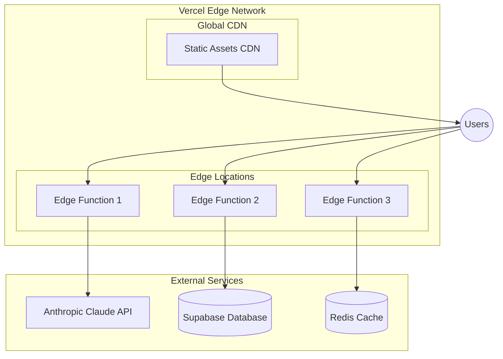

# AI Bill Splitter Infrastructure Architecture

*Generated by Alex - DevOps Infrastructure Specialist Platform Engineer*
*Created: December 2024*

---

## Document Overview

This document defines the comprehensive infrastructure architecture for the AI Bill Splitter application, ensuring scalability, reliability, security, and cost efficiency for production deployment.

---

## 1. Infrastructure Overview

### Current Project Analysis

Based on the project structure and macOS development guide, this is a **Next.js-based AI application** with the following characteristics:

- **Frontend**: Next.js 13+ with TypeScript and Tailwind CSS
- **Backend**: Next.js API Routes with Claude AI integration
- **AI Integration**: Anthropic Claude API for conversational bill splitting
- **Optional Services**: Supabase (database), Redis (caching)
- **Deployment Target**: Vercel (recommended)

### Infrastructure Requirements

**Core Infrastructure Needs:**
- **Cloud Provider**: Vercel (primary) with potential multi-cloud capability
- **Core Services**: Vercel Functions, Anthropic Claude API, optional Supabase/Redis
- **Regional Architecture**: Vercel's global edge network with automatic CDN
- **Multi-environment Strategy**: Development, Preview, Production with Vercel's built-in environment management

**Rationale for Vercel Choice:**
- **Next.js Native**: Optimal performance and deployment for Next.js applications
- **Serverless Functions**: Perfect for AI API integration with automatic scaling
- **Global CDN**: Built-in edge caching for optimal user experience
- **Environment Management**: Seamless dev/preview/production workflow
- **Cost Efficiency**: Pay-per-use model ideal for AI applications with variable load

**Key Assumptions:**
- Application will have moderate to high AI API usage
- User base primarily in Brazil (considering PIX payment integration)
- Need for real-time conversational AI responses
- Cost optimization important for AI API usage

**Areas Needing Validation:**
- Expected user load and concurrent AI requests
- Data residency requirements for Brazilian users
- Backup strategy for user data and conversation history
- Monitoring requirements for AI API costs and performance

---

## 2. Infrastructure as Code (IaC)

### Tools & Frameworks

**Primary IaC Stack:**
- **Vercel CLI**: Infrastructure deployment and configuration
- **GitHub Actions**: CI/CD pipeline automation
- **Environment Variables**: Secure configuration management
- **Vercel Dashboard**: Infrastructure monitoring and management

**Repository Structure:**
```
bill-splitter-ai-app/
├── .github/
│   └── workflows/
│       ├── deploy.yml
│       └── test.yml
├── vercel.json
├── .env.example
└── docs/
    └── infrastructure-architecture.md
```

**State Management:**
- Vercel handles infrastructure state automatically
- Configuration managed through Vercel dashboard and CLI
- Environment variables stored securely in Vercel

**Dependency Management:**
- Package.json for application dependencies
- Vercel handles infrastructure dependencies
- GitHub Actions manages CI/CD dependencies

**Critical Rule:** All infrastructure configuration must be version controlled. No manual resource creation in production environments.

---

## 3. Environment Configuration

### Environment Promotion Strategy

**Development Environment:**
- **Purpose**: Local development and testing
- **Resources**: Local machine with Node.js, npm, Git
- **Access Control**: Developer access only
- **Data Classification**: Test data only

**Preview Environment:**
- **Purpose**: Staging and pre-production testing
- **Resources**: Vercel preview deployments
- **Access Control**: Development team and stakeholders
- **Data Classification**: Anonymized production-like data

**Production Environment:**
- **Purpose**: Live application serving real users
- **Resources**: Vercel production deployment with global CDN
- **Access Control**: Restricted to DevOps and authorized personnel
- **Data Classification**: Real user data with encryption

### Configuration Management

**Environment Variables:**
```bash
# Required for all environments
ANTHROPIC_API_KEY=your_claude_api_key

# Optional for enhanced features
SUPABASE_URL=your_supabase_url
SUPABASE_ANON_KEY=your_supabase_key
REDIS_URL=your_redis_url
```

**Secret Management:**
- Vercel environment variables for sensitive data
- GitHub Secrets for CI/CD pipeline
- Local .env.local for development

**Feature Flag Integration:**
- Vercel Edge Config for feature flags
- Runtime configuration for A/B testing
- Environment-based feature toggles

---

## 4. Environment Transition Strategy

### Development to Production Pipeline

**Deployment Stages:**
1. **Development**: Local development with hot reload
2. **Preview**: Automatic deployment on PR creation
3. **Production**: Manual deployment with approval gates

**Deployment Gates:**
- Automated testing (unit, integration)
- Security scanning
- Performance benchmarks
- Cost impact analysis
- Manual approval for production

**Approval Workflows:**
- Development team: Preview deployments
- DevOps lead: Production deployments
- Security team: Security-critical changes

**Rollback Procedures:**
- Vercel automatic rollback on deployment failure
- Manual rollback through Vercel dashboard
- Database rollback procedures (if applicable)

**Change Cadence:**
- Development: Continuous deployment
- Preview: On every PR
- Production: Scheduled releases (weekly)

---

## 5. Network Architecture

### VPC/VNET Design

**Vercel Edge Network:**
- Global edge locations for optimal performance
- Automatic CDN for static assets
- Serverless functions at edge locations
- No traditional VPC required (Vercel managed)

### Security Groups & NACLs

**Vercel Security:**
- Built-in DDoS protection
- Automatic SSL/TLS certificates
- Edge security rules
- API rate limiting

### Load Balancers & API Gateways

**Vercel Edge Functions:**
- Automatic load balancing across edge locations
- Built-in API gateway functionality
- Request/response optimization
- Automatic scaling based on demand

### Network Diagram



---

## 6. Compute Resources

### Container Strategy

**Vercel Serverless Functions:**
- Automatic containerization and deployment
- Cold start optimization
- Memory and CPU allocation per function
- Automatic scaling based on demand

### Serverless Architecture

**Function Configuration:**
- **Runtime**: Node.js 18+
- **Memory**: 1024MB (configurable)
- **Timeout**: 10 seconds (configurable)
- **Concurrency**: Automatic scaling

### Auto-scaling Approach

**Vercel Auto-scaling:**
- Automatic scaling from 0 to thousands of instances
- Pay-per-use model
- No manual scaling configuration required
- Built-in performance monitoring

---

## 7. Data Resources

### Database Deployment Strategy

**Supabase Integration (Optional):**
- **Primary Database**: Supabase PostgreSQL
- **Backup Strategy**: Supabase automatic backups
- **Replication**: Supabase read replicas
- **Data Migration**: Supabase migration tools

### Backup & Recovery

**Vercel Backups:**
- Automatic function code backups
- Environment variable backups
- Static asset backups

**Supabase Backups (if used):**
- Daily automated backups
- Point-in-time recovery
- Cross-region backup replication

### Data Migration Strategy

**Development to Production:**
- Environment variable migration
- Database schema migration (if applicable)
- Static asset migration
- Configuration migration

---

## 8. Security Architecture

### IAM & Authentication

**Vercel Security:**
- Team-based access control
- Role-based permissions
- Two-factor authentication
- API token management

### Network Security

**Edge Security:**
- Automatic SSL/TLS encryption
- DDoS protection
- Rate limiting
- Request validation

### Data Encryption

**Data Protection:**
- Data in transit: TLS 1.3
- Data at rest: Vercel managed encryption
- Environment variables: Encrypted storage
- API keys: Secure storage and rotation

### Compliance Controls

**Security Standards:**
- SOC 2 compliance (Vercel)
- GDPR compliance
- Brazilian LGPD compliance
- PCI DSS (if payment processing)

### Security Scanning & Monitoring

**Security Tools:**
- Vercel security scanning
- Dependency vulnerability scanning
- Runtime security monitoring
- Security incident response

**Critical Rule:** Apply principle of least privilege for all access controls. Document all security exceptions with business justification.

---

## 9. Shared Responsibility Model

### Responsibility Matrix

| Component | Vercel | Platform Team | Development Team | Security Team |
|-----------|--------|---------------|------------------|---------------|
| Physical Security | ✓ | - | - | Audit |
| Network Security | ✓ | Config | - | Review |
| Application Security | Tools | - | ✓ | Audit |
| Data Encryption | Engine | Config | Implementation | Standards |
| AI API Security | - | - | ✓ | Review |
| User Data Protection | - | - | ✓ | Audit |

### Operational Monitoring Ownership

**Vercel Responsibilities:**
- Infrastructure uptime
- Edge network performance
- SSL certificate management
- DDoS protection

**Platform Team Responsibilities:**
- Deployment pipeline
- Environment management
- Cost monitoring
- Performance optimization

**Development Team Responsibilities:**
- Application security
- AI API integration security
- User data protection
- Feature security

**Security Team Responsibilities:**
- Security policy compliance
- Vulnerability assessment
- Incident response
- Security training

---

## 10. Monitoring & Observability

### Metrics Collection

**Vercel Analytics:**
- Real-time performance metrics
- Function execution metrics
- Edge network performance
- User experience metrics

**Custom Metrics:**
- AI API usage and costs
- User interaction patterns
- Error rates and types
- Business KPIs

### Logging Strategy

**Vercel Logs:**
- Function execution logs
- Edge network logs
- Error logs
- Performance logs

**Application Logs:**
- User interaction logs
- AI conversation logs
- Error tracking
- Performance monitoring

### Tracing Implementation

**Distributed Tracing:**
- Request flow tracking
- AI API call tracing
- Database query tracing
- Performance bottleneck identification

### Alerting & Incident Response

**Alert Configuration:**
- High error rates
- Performance degradation
- Cost threshold alerts
- Security incident alerts

**Incident Response:**
- Automated alerting
- Escalation procedures
- Runbook documentation
- Post-incident analysis

### Dashboards & Visualization

**Monitoring Dashboards:**
- Real-time performance dashboard
- Cost monitoring dashboard
- Security dashboard
- Business metrics dashboard

---

## 11. CI/CD Pipeline

### Pipeline Architecture

**GitHub Actions Workflow:**
```yaml
name: Deploy to Vercel
on:
  push:
    branches: [main]
  pull_request:
    branches: [main]

jobs:
  test:
    runs-on: ubuntu-latest
    steps:
      - uses: actions/checkout@v3
      - uses: actions/setup-node@v3
      - run: npm ci
      - run: npm test
      - run: npm run lint

  deploy-preview:
    if: github.event_name == 'pull_request'
    runs-on: ubuntu-latest
    steps:
      - uses: actions/checkout@v3
      - uses: amondnet/vercel-action@v25
        with:
          vercel-token: ${{ secrets.VERCEL_TOKEN }}
          vercel-org-id: ${{ secrets.ORG_ID }}
          vercel-project-id: ${{ secrets.PROJECT_ID }}
          vercel-args: '--target=preview'

  deploy-production:
    if: github.ref == 'refs/heads/main'
    runs-on: ubuntu-latest
    steps:
      - uses: actions/checkout@v3
      - uses: amondnet/vercel-action@v25
        with:
          vercel-token: ${{ secrets.VERCEL_TOKEN }}
          vercel-org-id: ${{ secrets.ORG_ID }}
          vercel-project-id: ${{ secrets.PROJECT_ID }}
          vercel-args: '--target=production'
```

### Build Process

**Build Stages:**
1. **Code Checkout**: Git repository cloning
2. **Dependency Installation**: npm install
3. **Testing**: Unit and integration tests
4. **Linting**: Code quality checks
5. **Build**: Next.js build process
6. **Deployment**: Vercel deployment

### Deployment Strategy

**Progressive Deployment:**
- **Preview Deployments**: Automatic on PR
- **Production Deployments**: Manual with approval
- **Rollback**: Automatic on failure

### Rollback Procedures

**Automatic Rollback:**
- Vercel automatic rollback on deployment failure
- Health check failure triggers rollback
- Performance degradation triggers rollback

**Manual Rollback:**
- Vercel dashboard rollback
- Git revert and redeploy
- Database rollback (if applicable)

### Approval Gates

**Deployment Gates:**
- Automated testing must pass
- Security scanning must pass
- Performance benchmarks must meet thresholds
- Manual approval for production deployments

---

## 12. Disaster Recovery

### Backup Strategy

**Vercel Backups:**
- Automatic function code backups
- Environment variable backups
- Static asset backups
- Configuration backups

**Application Data Backups:**
- Supabase automatic backups (if used)
- User conversation backups
- Configuration backups
- API key backups

### Recovery Procedures

**Infrastructure Recovery:**
- Vercel automatic failover
- Edge network redundancy
- Function redeployment
- Configuration restoration

**Data Recovery:**
- Database point-in-time recovery
- User data restoration
- Configuration restoration
- API key rotation

### RTO & RPO Targets

**Recovery Time Objectives (RTO):**
- **Critical**: 15 minutes (Vercel automatic failover)
- **Important**: 1 hour (manual intervention)
- **Normal**: 4 hours (planned maintenance)

**Recovery Point Objectives (RPO):**
- **Critical**: 5 minutes (real-time replication)
- **Important**: 1 hour (hourly backups)
- **Normal**: 24 hours (daily backups)

### DR Testing Approach

**Testing Schedule:**
- Monthly automated failover tests
- Quarterly manual recovery tests
- Annual comprehensive DR testing
- Continuous monitoring and validation

**Critical Rule:** DR procedures must be tested at least quarterly. Document test results and improvement actions.

---

## 13. Cost Optimization

### Resource Sizing Strategy

**Vercel Optimization:**
- Pay-per-use model
- Automatic scaling
- No idle resource costs
- Edge function optimization

### Reserved Instances/Commitments

**Vercel Pro Plan:**
- Predictable pricing
- Higher usage limits
- Priority support
- Advanced analytics

### Cost Monitoring & Reporting

**Cost Tracking:**
- Vercel usage monitoring
- AI API cost tracking
- Supabase usage monitoring
- Monthly cost reports

### Optimization Recommendations

**Cost Optimization Strategies:**
1. **AI API Optimization**: Use Haiku model for cost efficiency
2. **Caching Strategy**: Implement Redis for repeated requests
3. **CDN Optimization**: Leverage Vercel's global CDN
4. **Function Optimization**: Minimize cold starts
5. **Database Optimization**: Efficient queries and indexing

---

## 14. BMad Integration Architecture

### Development Agent Support

**Container Platform:**
- Vercel serverless functions for development
- GitOps workflows with GitHub Actions
- Service integration for development testing
- Developer self-service through Vercel dashboard

### Product & Architecture Alignment

**Infrastructure Implementation:**
- Scalability requirements from PRD
- Deployment automation for rapid iteration
- Service reliability meeting product SLAs
- Architecture patterns properly implemented

### Cross-Agent Integration Points

**CI/CD Integration:**
- GitHub Actions supporting all development workflows
- Monitoring data accessible to all agents
- Infrastructure enabling UI/UX performance requirements
- Platform supporting data collection and analysis needs

---

## 15. Feasibility Review

### DevOps/Platform Feasibility Assessment

**Green Light Items:**
- Vercel deployment strategy is highly feasible
- GitHub Actions CI/CD pipeline is standard practice
- Environment management is straightforward
- Security implementation is well-supported

**Yellow Light Items:**
- AI API cost monitoring needs careful implementation
- Database integration (if Supabase) requires additional setup
- Monitoring and observability may need custom implementation
- Cost optimization requires ongoing attention

**Red Light Items:**
- None identified - architecture is feasible with current tooling

**Mitigation Strategies:**
- Implement comprehensive cost monitoring for AI API usage
- Set up proper monitoring and alerting for all components
- Create detailed runbooks for operational procedures
- Establish regular architecture reviews

---

## 16. Infrastructure Verification

### Validation Framework

This infrastructure architecture will be validated using the comprehensive infrastructure checklist, ensuring:

- Completeness of architecture documentation
- Consistency with broader system architecture
- Appropriate level of detail for different stakeholders
- Clear implementation guidance
- Future evolution considerations

### Validation Process

The architecture documentation validation should be performed:

- After initial architecture development
- After significant architecture changes
- Before major implementation phases
- During periodic architecture reviews

---

## 17. Implementation Handoff

### Architecture Decision Records (ADRs)

**Key ADRs to Create:**
- Vercel as primary deployment platform
- Serverless architecture for AI integration
- GitHub Actions for CI/CD pipeline
- Supabase for optional database needs
- Redis for optional caching needs

### Implementation Validation Criteria

**Quality Gates:**
- Infrastructure as Code quality checks
- Security compliance validation
- Performance benchmarks
- Cost targets
- Operational readiness criteria

### Knowledge Transfer Requirements

**Documentation Needs:**
- Technical documentation for operations team
- Runbook creation for common procedures
- Training materials for platform team
- Handoff meeting agenda and materials

---

## 18. Infrastructure Evolution

### Technical Debt Inventory

**Current Technical Debt:**
- Minimal - using modern serverless architecture
- Potential debt in monitoring implementation
- Future debt in cost optimization

### Planned Upgrades and Migrations

**Short-term (3-6 months):**
- Implement comprehensive monitoring
- Set up cost optimization strategies
- Establish security scanning

**Long-term (6-12 months):**
- Evaluate multi-cloud strategy
- Consider advanced AI integration patterns
- Plan for scale-out requirements

### Technology Roadmap

**Technology Evolution:**
- Stay current with Vercel platform updates
- Monitor AI API technology evolution
- Evaluate new security tools and practices
- Consider advanced monitoring solutions

---

## 19. Integration with Application Architecture

### Service-to-Infrastructure Mapping

**Application Components:**
- **Frontend**: Vercel static hosting with CDN
- **API Routes**: Vercel serverless functions
- **AI Integration**: Anthropic Claude API
- **Database**: Supabase (optional)
- **Caching**: Redis (optional)

### Performance Requirements Implementation

**Performance Targets:**
- Page load time: < 2 seconds
- AI response time: < 5 seconds
- API response time: < 1 second
- Uptime: 99.9%

### Security Requirements Implementation

**Security Implementation:**
- HTTPS enforcement
- API key security
- User data protection
- Input validation
- Rate limiting

---

## 20. Cross-Team Collaboration

### Platform Engineer and Developer Touchpoints

**Collaboration Points:**
- Deployment pipeline configuration
- Environment management
- Performance optimization
- Security implementation

### Architecture Decision Impact Analysis

**Impact Assessment:**
- Development workflow changes
- Testing strategy updates
- Monitoring requirements
- Security considerations

---

## 21. Infrastructure Change Management

### Change Request Process

**Change Process:**
1. Change request submission
2. Impact assessment
3. Testing requirements
4. Approval workflow
5. Implementation
6. Validation

### Risk Assessment

**Risk Categories:**
- Security risks
- Performance risks
- Cost risks
- Availability risks

### Testing Strategy

**Testing Approach:**
- Automated testing in CI/CD
- Manual testing for complex changes
- Performance testing for critical changes
- Security testing for all changes

---

## Final Review

This infrastructure architecture provides a comprehensive foundation for the AI Bill Splitter application, ensuring:

- **Scalability**: Vercel's serverless architecture supports growth
- **Reliability**: Built-in redundancy and failover capabilities
- **Security**: Comprehensive security measures and compliance
- **Cost Efficiency**: Pay-per-use model with optimization strategies
- **Operational Excellence**: Clear procedures and monitoring

The architecture is feasible with current tooling and expertise, and provides a clear path for implementation and evolution.

---

*Document Version: 1.0*
*Last Updated: December 2024*
*Next Review: March 2025* 