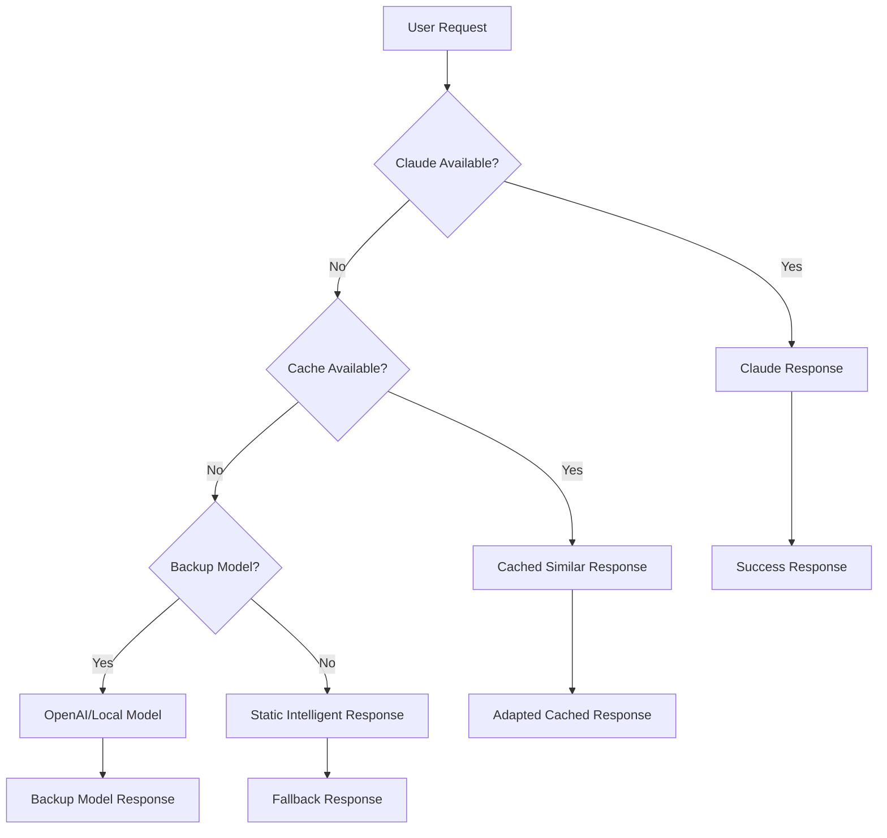

# AI Fallback Strategies Guide

## Overview

Comprehensive fallback strategies for AI applications ensuring service continuity during Claude API outages, high latency, or system failures while maintaining Brazilian user experience quality.

## 1. Fallback Architecture

### 1.1 Multi-Layer Fallback System


### 1.2 Fallback Trigger Conditions
```typescript
const fallbackTriggers = {
  claude_api_failures: {
    http_500_errors: "Server errors from Anthropic",
    timeout_threshold: "30 seconds response time",
    rate_limit_exceeded: "429 status codes",
    connection_errors: "Network connectivity issues"
  },
  
  performance_degradation: {
    latency_threshold: "10 seconds response time",
    error_rate_spike: "> 5% errors in 5 minutes",
    token_limit_reached: "Daily/monthly quota exceeded"
  },
  
  cost_overruns: {
    daily_budget_exceeded: "100% of daily budget used",
    user_quota_exceeded: "Individual user limits reached",
    emergency_cost_control: "Manual cost circuit breaker"
  },
  
  brazilian_specific: {
    network_instability: "High packet loss in Brazil",
    peak_traffic_hours: "19h-22h Brasília overload",
    regional_outages: "AWS SA-East-1 issues"
  }
};
```

## 2. Cache-Based Fallback Strategies

### 2.1 Intelligent Cache Fallback
```typescript
class IntelligentCacheFallback {
  async findSimilarCachedResponse(
    userQuery: string,
    similarityThreshold: number = 0.85
  ): Promise<CachedResponse | null> {
    // Generate embedding for user query
    const queryEmbedding = await this.generateEmbedding(userQuery);
    
    // Search cached responses by semantic similarity
    const similarResponses = await this.searchCacheByEmbedding(
      queryEmbedding,
      similarityThreshold
    );
    
    if (similarResponses.length > 0) {
      const bestMatch = similarResponses[0];
      
      // Adapt cached response to current context
      return this.adaptCachedResponse(bestMatch, userQuery);
    }
    
    return null;
  }
  
  // Adapt cached response to current query
  adaptCachedResponse(
    cachedResponse: CachedResponse,
    currentQuery: string
  ): AdaptedResponse {
    return {
      content: this.personalizeResponse(cachedResponse.content, currentQuery),
      confidence: cachedResponse.similarity,
      source: 'cache_adapted',
      timestamp: new Date(),
      original_query: cachedResponse.original_query,
      adaptation_note: "Resposta baseada em consulta similar anterior"
    };
  }
  
  // Brazilian Portuguese response adaptation
  personalizeResponse(content: string, currentQuery: string): string {
    // Add contextual introduction
    const introduction = this.generateContextualIntro(currentQuery);
    
    // Adapt language formality if needed
    const adaptedContent = this.adjustFormality(content, currentQuery);
    
    // Add Brazilian cultural context
    const culturallyAdapted = this.addBrazilianContext(adaptedContent);
    
    return `${introduction}\n\n${culturallyAdapted}`;
  }
}
```

### 2.2 Proactive Cache Warming
```typescript
const cacheWarmingStrategy = {
  // Pre-populate cache with common Brazilian queries
  commonBrazilianQueries: [
    "Como funciona o PIX?",
    "O que é LGPD?",
    "Como declarar imposto de renda?",
    "Documentos necessários para CNH",
    "Como abrir uma empresa no Brasil?",
    "Direitos trabalhistas no Brasil",
    "Como funciona o SUS?",
    "Benefícios do INSS"
  ],
  
  // Seasonal content preparation
  seasonalCaching: {
    tax_season: "Janeiro-Abril: IR, IPTU, IPVA",
    black_friday: "Novembro: Promoções, direitos do consumidor",
    christmas: "Dezembro: 13º salário, férias",
    back_to_school: "Janeiro-Fevereiro: Educação, matrículas"
  },
  
  // Regional content caching
  regionalContent: {
    southeast: "Trânsito SP/RJ, custo de vida",
    northeast: "Programas sociais, turismo",
    south: "Agronegócio, cooperativas",
    north: "Zona Franca, questões ambientais"
  }
};
```

## 3. Alternative AI Model Fallbacks

### 3.1 Backup Model Integration
```typescript
class BackupModelFallback {
  private modelPriority = [
    { provider: 'anthropic', model: 'claude-3-sonnet', cost: 'high' },
    { provider: 'openai', model: 'gpt-4-turbo', cost: 'high' },
    { provider: 'openai', model: 'gpt-3.5-turbo', cost: 'medium' },
    { provider: 'huggingface', model: 'local-pt-model', cost: 'low' }
  ];
  
  async executeWithFallback(
    prompt: string,
    context: ConversationContext
  ): Promise<AIResponse> {
    for (const model of this.modelPriority) {
      try {
        const response = await this.callModel(model, prompt, context);
        
        if (this.validateResponse(response)) {
          return {
            content: response,
            model_used: model,
            fallback_level: this.getFallbackLevel(model),
            quality_score: this.assessQuality(response)
          };
        }
      } catch (error) {
        console.log(`Model ${model.provider}:${model.model} failed:`, error);
        continue;
      }
    }
    
    // If all AI models fail, use rule-based fallback
    return this.ruleBasedFallback(prompt, context);
  }
  
  // OpenAI as primary backup
  async callOpenAI(prompt: string, context: ConversationContext): Promise<string> {
    const systemPrompt = `Você é um assistente virtual brasileiro.
    Responda em português brasileiro de forma clara e útil.
    Contexto da conversa: ${context.summary}`;
    
    const response = await openai.chat.completions.create({
      model: 'gpt-3.5-turbo',
      messages: [
        { role: 'system', content: systemPrompt },
        { role: 'user', content: prompt }
      ],
      max_tokens: 1000,
      temperature: 0.7
    });
    
    return response.choices[0].message.content;
  }
}
```

### 3.2 Local Model Deployment
```typescript
const localModelFallback = {
  // Lightweight Portuguese model for offline capability
  localModel: {
    name: "gpt2-small-portuguese",
    size: "500MB",
    deployment: "Docker container",
    performance: "10-20 tokens/second",
    use_case: "Emergency fallback only"
  },
  
  // Edge computing setup
  edgeDeployment: {
    location: "São Paulo CDN edge",
    latency: "< 100ms for Brazilian users",
    availability: "99.9% uptime",
    scaling: "Auto-scale based on demand"
  },
  
  // Quality expectations
  qualityProfile: {
    accuracy: "70-80% vs Claude",
    fluency: "Good Portuguese grammar",
    context_awareness: "Limited to 1-2 exchanges",
    cultural_relevance: "Basic Brazilian context"
  }
};
```

## 4. Rule-Based Fallback Systems

### 4.1 Intent-Based Static Responses
```typescript
class RuleBasedFallback {
  private staticResponses = {
    greeting: [
      "Olá! No momento estou com algumas limitações técnicas, mas posso tentar ajudar. Em que posso ser útil?",
      "Oi! Tivemos um probleminha no sistema, mas estou aqui para ajudar no que conseguir. Qual sua dúvida?"
    ],
    
    help_request: [
      "Entendo que precisa de ajuda. Embora eu esteja com funcionalidade limitada no momento, posso tentar orientá-lo de forma básica.",
      "Vou fazer o meu melhor para ajudar, mesmo com as limitações atuais do sistema."
    ],
    
    technical_question: [
      "Para questões técnicas específicas, recomendo consultar nossa documentação ou entrar em contato com nosso suporte técnico.",
      "No momento não consigo processar questões técnicas complexas. Que tal tentar novamente em alguns minutos?"
    ],
    
    complaint: [
      "Lamento pelos problemas que está enfrentando. Nossa equipe técnica está trabalhando para resolver as questões do sistema.",
      "Entendo sua frustração. Estamos cientes dos problemas técnicos e trabalhando na solução."
    ]
  };
  
  async generateRuleBasedResponse(
    intent: string,
    userMessage: string,
    context: ConversationContext
  ): Promise<FallbackResponse> {
    const responses = this.staticResponses[intent] || this.staticResponses.help_request;
    const selectedResponse = this.selectResponse(responses, context);
    
    return {
      content: this.personalizeStaticResponse(selectedResponse, context),
      type: 'rule_based',
      confidence: 0.6,
      suggestions: this.generateHelpfulSuggestions(intent),
      escalation_options: this.getEscalationOptions()
    };
  }
  
  generateHelpfulSuggestions(intent: string): string[] {
    const suggestions = {
      technical_question: [
        "Consultar nossa documentação online",
        "Tentar novamente em alguns minutos",
        "Entrar em contato com suporte técnico"
      ],
      general_inquiry: [
        "Reformular a pergunta de forma mais simples",
        "Verificar nossa seção de perguntas frequentes",
        "Aguardar a normalização do sistema"
      ]
    };
    
    return suggestions[intent] || suggestions.general_inquiry;
  }
}
```

### 4.2 Brazilian Context-Aware Responses
```typescript
const brazilianContextualResponses = {
  business_hours: {
    condition: "8h-18h Brasília",
    message: "Nosso suporte está disponível para ajudar via telefone ou chat durante horário comercial.",
    action: "Oferecer contato direto"
  },
  
  off_hours: {
    condition: "18h-8h Brasília",
    message: "Fora do horário comercial. Deixe sua mensagem que retornaremos primeiro horário útil.",
    action: "Oferecer formulário de contato"
  },
  
  weekend: {
    condition: "Sábado/Domingo",
    message: "Final de semana é sagrado! Segunda-feira estaremos de volta para ajudar melhor.",
    action: "Agendar contato para segunda-feira"
  },
  
  holidays: {
    condition: "Feriados nacionais",
    message: "Hoje é feriado nacional. Aproveitando o descanso merecido! Voltamos no próximo dia útil.",
    action: "Informar próximo dia útil"
  }
};
```

## 5. Progressive Degradation

### 5.1 Feature Degradation Levels
```typescript
const degradationLevels = {
  level_1_minimal: {
    available_features: [
      "Basic chat with cached responses",
      "FAQ access",
      "Contact information"
    ],
    disabled_features: [
      "Real-time AI responses",
      "Complex analysis",
      "Personalization"
    ],
    user_message: "Funcionalidade limitada - respostas básicas disponíveis"
  },
  
  level_2_moderate: {
    available_features: [
      "Simple AI responses via backup model",
      "Basic document search",
      "User session management"
    ],
    disabled_features: [
      "Advanced AI features",
      "Real-time learning",
      "Complex workflows"
    ],
    user_message: "Modo de contingência - funcionalidades essenciais ativas"
  },
  
  level_3_severe: {
    available_features: [
      "Static help content",
      "Contact forms",
      "System status page"
    ],
    disabled_features: [
      "All AI features",
      "Dynamic content",
      "Interactive features"
    ],
    user_message: "Sistema em manutenção - apenas funções básicas disponíveis"
  }
};
```

### 5.2 Graceful UI Adaptation
```typescript
const uiAdaptationStrategy = {
  // Inform users about limitations
  statusBanner: {
    level_1: "⚠️ Algumas funcionalidades de IA estão temporariamente limitadas",
    level_2: "🔧 Sistema em modo de contingência - funcionalidades básicas ativas",
    level_3: "🚫 Sistema em manutenção - apenas consultas básicas disponíveis"
  },
  
  // Adjust user expectations
  responseTimeWarning: {
    backup_model: "Usando modelo de backup - respostas podem ser mais simples",
    cache_only: "Respostas baseadas em conteúdo pré-processado",
    static_only: "Apenas respostas pré-definidas disponíveis no momento"
  },
  
  // Provide alternatives
  alternativeActions: {
    contact_support: "Falar com atendente humano",
    schedule_callback: "Agendar retorno de chamada",
    email_inquiry: "Enviar dúvida por email",
    knowledge_base: "Consultar base de conhecimento"
  }
};
```

## 6. Recovery and Escalation

### 6.1 Automatic Recovery
```typescript
class AutoRecoverySystem {
  async monitorAndRecover(): Promise<void> {
    setInterval(async () => {
      const systemHealth = await this.checkSystemHealth();
      
      if (systemHealth.claude_api.status === 'degraded') {
        await this.attemptGradualRecovery();
      }
      
      if (systemHealth.claude_api.status === 'healthy') {
        await this.restoreFullFunctionality();
      }
    }, 30000); // Check every 30 seconds
  }
  
  async attemptGradualRecovery(): Promise<void> {
    // Try with reduced load first
    const testQuery = "Olá, como você está?";
    
    try {
      const response = await this.callClaudeWithTimeout(testQuery, 10000);
      
      if (response.success) {
        await this.increaseTrafficGradually();
      }
    } catch (error) {
      console.log('Recovery attempt failed:', error);
    }
  }
  
  async restoreFullFunctionality(): Promise<void> {
    // Gradually increase traffic to Claude
    await this.updateFallbackStrategy('primary_claude');
    
    // Notify users of restoration
    await this.broadcastStatusUpdate(
      "✅ Todas as funcionalidades foram restauradas"
    );
    
    // Log recovery for analysis
    await this.logRecoveryEvent();
  }
}
```

### 6.2 Human Escalation
```typescript
const humanEscalation = {
  escalation_triggers: [
    "User explicitly requests human help",
    "Complex problem requiring human judgment", 
    "Legal or compliance questions",
    "Emotional distress detected",
    "Multiple fallback failures"
  ],
  
  escalation_process: {
    immediate: "Critical issues - 24/7 on-call",
    priority: "Business hours - 1 hour response",
    standard: "Business hours - 4 hour response",
    low: "Next business day response"
  },
  
  brazilian_escalation: {
    language: "Portuguese native speakers only",
    cultural_training: "Brazilian business culture",
    legal_knowledge: "LGPD and local regulations",
    payment_systems: "PIX, boleto, local banks"
  }
};
```

## 7. Communication Strategy

### 7.1 User Communication Templates
```typescript
const communicationTemplates = {
  service_degradation: {
    title: "Funcionalidades Temporariamente Limitadas",
    message: `Olá! 👋

No momento, nosso sistema de IA está com algumas limitações técnicas. 

✅ O que está funcionando:
- Consultas básicas com respostas rápidas
- Acesso ao histórico de conversas
- Suporte via chat com nossa equipe

⚠️ O que pode estar mais lento:
- Respostas detalhadas de IA
- Análises complexas
- Recursos avançados

Nossa equipe técnica está trabalhando para normalizar tudo o mais rápido possível.

Obrigado pela compreensão! 🙏`,
    
    estimated_recovery: "2-4 horas",
    alternative_contact: "+55 11 9999-9999"
  },
  
  full_outage: {
    title: "Sistema Temporariamente Indisponível",
    message: `Olá! 

Identificamos um problema técnico que está afetando nossos serviços de IA.

🔧 Nossa equipe está trabalhando na solução
📞 Para urgências: ${process.env.EMERGENCY_PHONE}
📧 Para dúvidas: ${process.env.SUPPORT_EMAIL}

Atualizaremos você assim que tudo voltar ao normal.

Desculpe o transtorno! 🙏`,
    
    status_page: "https://status.empresa.com.br",
    updates_frequency: "A cada 30 minutos"
  }
};
```

## Best Practices Summary

1. **Multi-Layer Defense**: Implement cache, backup models, and static responses
2. **Brazilian Context**: Maintain cultural relevance even in fallback modes  
3. **Graceful Degradation**: Reduce features progressively, not abruptly
4. **Clear Communication**: Keep users informed with honest, warm messaging
5. **Automatic Recovery**: Monitor and restore services automatically
6. **Human Escalation**: Provide clear paths to human support
7. **Performance Monitoring**: Track fallback usage and effectiveness
8. **Regional Optimization**: Consider Brazilian network and infrastructure patterns 