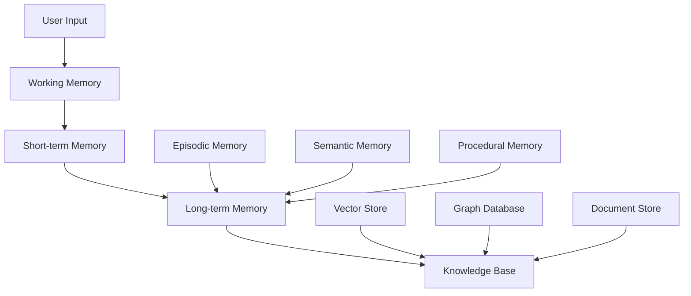

# AI Memory & RAG Systems Guide

## Overview

Comprehensive guide for implementing intelligent memory systems and Retrieval-Augmented Generation (RAG) for AI applications, with Portuguese language optimization and Brazilian user behavior patterns.

## 1. Memory System Architecture

### 1.1 Multi-Tier Memory Model


### 1.2 Memory Types Implementation
```typescript
interface MemorySystem {
  // Working memory - current conversation context
  workingMemory: {
    maxTokens: 4000;
    retentionTime: "session";
    content: ConversationContext;
  };
  
  // Short-term memory - recent interactions
  shortTermMemory: {
    retentionTime: "7 days";
    capacity: "last 100 interactions";
    indexing: "temporal + semantic";
  };
  
  // Long-term memory - persistent user knowledge
  longTermMemory: {
    retentionTime: "indefinite";
    structure: "hierarchical + semantic";
    consolidation: "automatic + manual";
  };
  
  // Knowledge base - domain knowledge
  knowledgeBase: {
    scope: "organizational + public";
    updateFrequency: "real-time";
    versioning: "enabled";
  };
}
```

## 2. RAG Implementation Patterns

### 2.1 Hybrid RAG Architecture
```typescript
class HybridRAGSystem {
  // Dense retrieval with vector embeddings
  async denseRetrieval(query: string, filters?: SearchFilters) {
    const embedding = await this.generateEmbedding(query);
    
    return await this.vectorDB.similaritySearch({
      vector: embedding,
      topK: 10,
      threshold: 0.7,
      filters: {
        language: 'pt-BR',
        region: 'brazil',
        ...filters
      }
    });
  }
  
  // Sparse retrieval with keyword matching
  async sparseRetrieval(query: string) {
    return await this.searchEngine.search({
      query: this.preprocessPortugueseQuery(query),
      fields: ['title', 'content', 'tags'],
      boost: {
        title: 2.0,
        recent: 1.5,
        exact_match: 3.0
      }
    });
  }
  
  // Fusion retrieval combining both approaches
  async fusionRetrieval(query: string) {
    const [dense, sparse] = await Promise.all([
      this.denseRetrieval(query),
      this.sparseRetrieval(query)
    ]);
    
    return this.reciprocalRankFusion(dense, sparse);
  }
  
  // Portuguese query preprocessing
  preprocessPortugueseQuery(query: string): string {
    return query
      .toLowerCase()
      .replace(/[àáâãä]/g, 'a')
      .replace(/[èéêë]/g, 'e')
      .replace(/[ìíîï]/g, 'i')
      .replace(/[òóôõö]/g, 'o')
      .replace(/[ùúûü]/g, 'u')
      .replace(/ç/g, 'c')
      .trim();
  }
}
```

### 2.2 Advanced Retrieval Techniques
```typescript
class AdvancedRetrieval {
  // Hypothetical Document Embeddings (HyDE)
  async hydeRetrieval(query: string) {
    // Generate hypothetical answer
    const hypotheticalAnswer = await this.claude.generate({
      prompt: `Responda à pergunta em português brasileiro: ${query}`,
      maxTokens: 200
    });
    
    // Use hypothetical answer for retrieval
    const embedding = await this.generateEmbedding(hypotheticalAnswer);
    return await this.vectorDB.search(embedding);
  }
  
  // Multi-query retrieval
  async multiQueryRetrieval(originalQuery: string) {
    // Generate query variations
    const variations = await this.claude.generate({
      prompt: `Gere 3 variações da pergunta mantendo o mesmo significado:
      "${originalQuery}"
      
      Variações:`,
      maxTokens: 150
    });
    
    const queries = [originalQuery, ...this.parseVariations(variations)];
    
    // Retrieve for each query
    const results = await Promise.all(
      queries.map(q => this.denseRetrieval(q))
    );
    
    return this.deduplicateAndRank(results.flat());
  }
  
  // Contextual retrieval with conversation history
  async contextualRetrieval(
    query: string, 
    conversationHistory: Message[]
  ) {
    // Build contextual query
    const context = this.buildConversationContext(conversationHistory);
    const contextualQuery = `${context}\n\nPergunta atual: ${query}`;
    
    // Retrieve with enhanced context
    return await this.fusionRetrieval(contextualQuery);
  }
}
```

## 3. Portuguese Language Optimization

### 3.1 Language-Specific Processing
```typescript
class PortugueseNLP {
  // Portuguese text preprocessing pipeline
  async preprocessPortugueseText(text: string): Promise<ProcessedText> {
    return {
      // Normalization
      normalized: this.normalizeAccents(text),
      
      // Tokenization (Portuguese-aware)
      tokens: await this.tokenize(text, 'pt-BR'),
      
      // Stemming for Portuguese
      stemmed: await this.stemPortuguese(text),
      
      // Named Entity Recognition
      entities: await this.extractPortugueseEntities(text),
      
      // Sentiment analysis
      sentiment: await this.analyzeSentiment(text, 'pt-BR'),
      
      // Regional dialect detection
      dialect: this.detectRegionalDialect(text)
    };
  }
  
  // Brazilian Portuguese synonyms and variations
  expandPortugueseQuery(query: string): string[] {
    const synonymMap = {
      'dinheiro': ['grana', 'bufunfa', 'real', 'reais', 'grana', 'nota'],
      'trabalho': ['trampo', 'emprego', 'job', 'serviço', 'ocupação'],
      'casa': ['lar', 'residência', 'moradia', 'habitação'],
      'carro': ['automóvel', 'veículo', 'auto', 'carro'],
      'comida': ['alimento', 'refeição', 'comida', 'alimentação'],
      'telefone': ['celular', 'móvel', 'fone', 'telefone'],
      'computador': ['PC', 'máquina', 'computador', 'notebook']
    };
    
    const words = query.split(' ');
    const expandedQueries = [query];
    
    words.forEach(word => {
      if (synonymMap[word.toLowerCase()]) {
        synonymMap[word.toLowerCase()].forEach(synonym => {
          const newQuery = query.replace(word, synonym);
          expandedQueries.push(newQuery);
        });
      }
    });
    
    return [...new Set(expandedQueries)];
  }
  
  // Cultural context detection
  detectCulturalContext(text: string): CulturalContext {
    const patterns = {
      // Brazilian institutions
      government: /\b(sus|inss|fgts|cpf|cnpj|receita federal)\b/i,
      
      // Payment methods
      payments: /\b(pix|boleto|cartão|débito|crédito)\b/i,
      
      // Regional references
      regions: {
        northeast: /\b(nordeste|bahia|pernambuco|ceará|oxente|massa)\b/i,
        southeast: /\b(são paulo|rio|minas|sudeste|sô|mano)\b/i,
        south: /\b(sul|gaúcho|tchê|guri|prenda)\b/i,
        north: /\b(norte|amazonas|pará|manaus)\b/i
      },
      
      // Brazilian slang
      colloquial: /\b(galera|pessoal|véi|cara|mano|valeu)\b/i
    };
    
    return {
      hasGovernmentContext: patterns.government.test(text),
      hasPaymentContext: patterns.payments.test(text),
      detectedRegion: this.detectRegion(text, patterns.regions),
      formalityLevel: this.assessFormality(text),
      hasColloquialisms: patterns.colloquial.test(text)
    };
  }
}
```

### 3.2 Embedding Optimization for Portuguese
```typescript
class PortugueseEmbeddings {
  // Multi-model embedding strategy
  async generatePortugueseEmbedding(text: string): Promise<number[]> {
    // Preprocess for Portuguese
    const processed = await this.preprocessPortugueseText(text);
    
    // Use Portuguese-optimized model if available
    const model = this.selectBestModel(processed);
    
    return await this.embeddingClient.create({
      model: model,
      input: processed.normalized,
      language: 'pt-BR'
    });
  }
  
  // Embedding quality assessment
  async assessEmbeddingQuality(
    text: string, 
    embedding: number[]
  ): Promise<QualityMetrics> {
    return {
      // Semantic coherence
      coherence: await this.measureCoherence(text, embedding),
      
      // Language-specific accuracy
      languageAccuracy: await this.testPortugueseAccuracy(embedding),
      
      // Cultural relevance
      culturalRelevance: this.assessCulturalAlignment(text, embedding),
      
      // Retrieval effectiveness
      retrievalQuality: await this.testRetrievalAccuracy(text, embedding)
    };
  }
  
  // Embedding cache with Portuguese considerations
  async cacheEmbedding(text: string, embedding: number[]): Promise<void> {
    const key = this.generateCacheKey(text);
    
    await this.cache.set(key, {
      embedding,
      text,
      language: 'pt-BR',
      timestamp: new Date(),
      normalizedText: this.normalizeForCache(text),
      metadata: {
        dialect: this.detectRegionalDialect(text),
        formality: this.assessFormality(text),
        domain: this.detectDomain(text)
      }
    }, {
      ttl: 86400 // 24 hours
    });
  }
}
```

## 4. User Memory Management

### 4.1 Personalized Memory System
```typescript
class PersonalizedMemory {
  // User profile and preferences
  async buildUserProfile(userId: string): Promise<UserProfile> {
    const interactions = await this.getUserInteractions(userId);
    
    return {
      // Communication preferences
      communicationStyle: this.analyzeCommunicationStyle(interactions),
      preferredFormality: this.detectFormalityPreference(interactions),
      responseLength: this.analyzePreferredResponseLength(interactions),
      
      // Topic interests
      topicInterests: await this.extractTopicInterests(interactions),
      domainExpertise: this.assessUserExpertise(interactions),
      
      // Behavioral patterns
      sessionPatterns: this.analyzeSessionPatterns(interactions),
      questionTypes: this.categorizeQuestionTypes(interactions),
      
      // Contextual information
      timezone: 'America/Sao_Paulo',
      language: 'pt-BR',
      region: await this.inferUserRegion(interactions),
      
      // Learning preferences
      learningStyle: this.identifyLearningStyle(interactions),
      preferredExamples: this.extractPreferredExamples(interactions)
    };
  }
  
  // Adaptive memory consolidation
  async consolidateMemories(userId: string): Promise<ConsolidationReport> {
    const memories = await this.getUserMemories(userId);
    
    // Identify important memories
    const importantMemories = memories.filter(m => 
      m.accessCount > 5 || 
      m.userRating > 4 ||
      m.recency < 7 // days
    );
    
    // Merge similar memories
    const consolidatedMemories = await this.mergeSimilarMemories(
      importantMemories
    );
    
    // Extract patterns
    const patterns = await this.extractUserPatterns(consolidatedMemories);
    
    // Update user model
    await this.updateUserModel(userId, patterns);
    
    return {
      memoriesProcessed: memories.length,
      memoriesConsolidated: consolidatedMemories.length,
      patternsExtracted: patterns.length,
      consolidationDate: new Date()
    };
  }
  
  // Context-aware memory retrieval
  async retrieveRelevantMemories(
    userId: string,
    currentContext: string
  ): Promise<RelevantMemory[]> {
    const userProfile = await this.getUserProfile(userId);
    
    // Semantic similarity search
    const semanticMemories = await this.semanticMemorySearch(
      userId, 
      currentContext
    );
    
    // Temporal relevance
    const temporalMemories = await this.getRecentMemories(userId, 7);
    
    // Pattern-based memories
    const patternMemories = await this.getPatternBasedMemories(
      userId, 
      currentContext
    );
    
    // Combine and rank
    return this.rankAndCombineMemories([
      ...semanticMemories,
      ...temporalMemories,
      ...patternMemories
    ], userProfile);
  }
}
```

### 4.2 Learning and Adaptation
```typescript
class AdaptiveLearning {
  // Learn from user feedback
  async learnFromFeedback(
    interaction: Interaction,
    feedback: UserFeedback
  ): Promise<void> {
    if (feedback.rating >= 4) {
      // Positive feedback - reinforce patterns
      await this.reinforceSuccessfulPatterns(interaction);
    } else if (feedback.rating <= 2) {
      // Negative feedback - adjust approach
      await this.adjustUserModel(interaction, feedback);
    }
    
    // Extract learning signals
    const learningSignals = this.extractLearningSignals(
      interaction, 
      feedback
    );
    
    // Update user preferences
    await this.updateUserPreferences(
      interaction.userId, 
      learningSignals
    );
  }
  
  // Continuous learning from interactions
  async continuousLearning(userId: string): Promise<void> {
    const recentInteractions = await this.getRecentInteractions(userId);
    
    // Analyze interaction patterns
    const patterns = this.analyzeInteractionPatterns(recentInteractions);
    
    // Detect preference changes
    const preferenceChanges = this.detectPreferenceChanges(
      userId, 
      patterns
    );
    
    // Update models
    if (preferenceChanges.length > 0) {
      await this.updateAdaptiveModels(userId, preferenceChanges);
    }
    
    // Personalize future responses
    await this.personalizeResponseStrategies(userId, patterns);
  }
}
```

## 5. Knowledge Base Management

### 5.1 Dynamic Knowledge Updates
```typescript
class DynamicKnowledgeBase {
  // Real-time knowledge ingestion
  async ingestNewKnowledge(
    documents: Document[],
    source: KnowledgeSource
  ): Promise<IngestionReport> {
    const report: IngestionReport = {
      processed: 0,
      successful: 0,
      failed: 0,
      duplicates: 0
    };
    
    for (const doc of documents) {
      try {
        // Check for duplicates
        if (await this.isDuplicate(doc)) {
          report.duplicates++;
          continue;
        }
        
        // Process document
        const processed = await this.processDocument(doc);
        
        // Generate embeddings
        const embeddings = await this.generateEmbeddings(processed);
        
        // Store in knowledge base
        await this.storeKnowledge(processed, embeddings, source);
        
        report.successful++;
      } catch (error) {
        report.failed++;
        await this.logIngestionError(doc, error);
      }
      
      report.processed++;
    }
    
    // Update knowledge base metadata
    await this.updateKnowledgeBaseMetadata(source, report);
    
    return report;
  }
  
  // Knowledge validation and quality control
  async validateKnowledgeQuality(
    knowledgeId: string
  ): Promise<QualityAssessment> {
    const knowledge = await this.getKnowledge(knowledgeId);
    
    return {
      // Content quality
      relevance: await this.assessRelevance(knowledge),
      accuracy: await this.verifyAccuracy(knowledge),
      completeness: this.assessCompleteness(knowledge),
      
      // Language quality
      languageQuality: await this.assessPortugueseQuality(knowledge),
      culturalRelevance: this.assessCulturalRelevance(knowledge),
      
      // Technical quality
      embeddingQuality: await this.validateEmbeddings(knowledge),
      metadataCompleteness: this.validateMetadata(knowledge),
      
      // Overall score
      overallScore: this.calculateQualityScore(knowledge)
    };
  }
}
```

### 5.2 Knowledge Graph Integration
```typescript
class KnowledgeGraph {
  // Build semantic relationships
  async buildSemanticGraph(domain: string): Promise<SemanticGraph> {
    const entities = await this.extractEntities(domain);
    const relationships = await this.extractRelationships(entities);
    
    return {
      nodes: entities.map(entity => ({
        id: entity.id,
        type: entity.type,
        properties: entity.properties,
        embeddings: entity.embeddings
      })),
      
      edges: relationships.map(rel => ({
        source: rel.source,
        target: rel.target,
        type: rel.type,
        weight: rel.confidence,
        properties: rel.properties
      }))
    };
  }
  
  // Graph-enhanced retrieval
  async graphEnhancedRetrieval(
    query: string,
    depth: number = 2
  ): Promise<GraphRetrievalResult> {
    // Initial semantic search
    const initialResults = await this.semanticSearch(query);
    
    // Expand through graph relationships
    const expandedResults = await this.expandThroughGraph(
      initialResults,
      depth
    );
    
    // Path-based scoring
    const scoredResults = this.scoreByGraphPaths(
      expandedResults,
      query
    );
    
    return {
      directMatches: initialResults,
      expandedMatches: expandedResults,
      scoredResults: scoredResults,
      graphPaths: this.extractRelevantPaths(scoredResults)
    };
  }
}
```

## 6. Performance Optimization

### 6.1 Efficient Memory Access
```typescript
class MemoryOptimization {
  // Memory access patterns
  async optimizeMemoryAccess(userId: string): Promise<void> {
    // Preload frequently accessed memories
    const frequentMemories = await this.getFrequentlyAccessedMemories(userId);
    await this.preloadToCache(frequentMemories);
    
    // Optimize storage layout
    await this.optimizeStorageLayout(userId);
    
    // Update access patterns
    await this.updateAccessPatterns(userId);
  }
  
  // Hierarchical caching strategy
  async implementHierarchicalCaching(): Promise<void> {
    // L1: In-memory cache (hot data)
    this.l1Cache = new LRUCache({
      max: 1000,
      ttl: 300000 // 5 minutes
    });
    
    // L2: Redis cache (warm data)
    this.l2Cache = new RedisCache({
      ttl: 3600, // 1 hour
      maxMemory: '1gb'
    });
    
    // L3: Database cache (cold data)
    this.l3Cache = new DatabaseCache({
      ttl: 86400 // 24 hours
    });
  }
  
  // Smart prefetching
  async smartPrefetch(userId: string, context: string): Promise<void> {
    // Predict likely next queries
    const predictions = await this.predictNextQueries(userId, context);
    
    // Prefetch relevant memories
    for (const prediction of predictions) {
      if (prediction.confidence > 0.7) {
        await this.prefetchMemories(userId, prediction.query);
      }
    }
  }
}
```

### 6.2 Scalability Patterns
```typescript
class ScalabilityOptimization {
  // Distributed memory architecture
  async implementDistributedMemory(): Promise<void> {
    // Shard by user ID
    const shard = this.calculateUserShard(userId);
    
    // Route to appropriate memory store
    const memoryStore = this.getMemoryStore(shard);
    
    // Implement consistent hashing
    this.consistentHash = new ConsistentHash({
      nodes: this.memoryStores,
      replicas: 3
    });
  }
  
  // Asynchronous processing
  async processAsynchronously(
    operation: MemoryOperation
  ): Promise<OperationResult> {
    // Queue for background processing
    await this.backgroundQueue.add('memory-operation', {
      operation,
      priority: operation.priority,
      userId: operation.userId
    });
    
    // Return immediate acknowledgment
    return {
      status: 'queued',
      operationId: operation.id,
      estimatedCompletion: this.estimateCompletion(operation)
    };
  }
}
```

## 7. Privacy and Security

### 7.1 Privacy-Preserving Memory
```typescript
class PrivacyPreservingMemory {
  // Differential privacy for user data
  async applyDifferentialPrivacy(
    userData: UserData,
    epsilon: number = 1.0
  ): Promise<PrivateUserData> {
    // Add calibrated noise
    const noisyData = this.addLaplaceNoise(userData, epsilon);
    
    // Preserve utility while protecting privacy
    return this.optimizePrivacyUtilityTradeoff(noisyData, epsilon);
  }
  
  // Federated learning for user models
  async federatedUserModelUpdate(
    localModel: UserModel,
    globalModel: GlobalModel
  ): Promise<UpdatedModel> {
    // Local computation without sharing raw data
    const localGradients = this.computeLocalGradients(localModel);
    
    // Secure aggregation
    const aggregatedUpdate = await this.secureAggregation(
      localGradients
    );
    
    return this.updateGlobalModel(globalModel, aggregatedUpdate);
  }
  
  // Homomorphic encryption for sensitive computations
  async homomorphicComputation(
    encryptedData: EncryptedData,
    computation: Computation
  ): Promise<EncryptedResult> {
    // Perform computation on encrypted data
    return this.performHomomorphicOperation(encryptedData, computation);
  }
}
```

## 8. Evaluation and Metrics

### 8.1 Memory System Evaluation
```typescript
class MemoryEvaluation {
  // Comprehensive evaluation framework
  async evaluateMemorySystem(userId: string): Promise<EvaluationReport> {
    return {
      // Accuracy metrics
      retrievalAccuracy: await this.measureRetrievalAccuracy(userId),
      memoryRelevance: await this.assessMemoryRelevance(userId),
      
      // Performance metrics
      responseTime: await this.measureResponseTime(userId),
      throughput: await this.measureThroughput(userId),
      
      // User experience metrics
      userSatisfaction: await this.getUserSatisfaction(userId),
      engagementLevel: await this.measureEngagement(userId),
      
      // Privacy metrics
      privacyCompliance: await this.assessPrivacyCompliance(userId),
      dataMinimization: await this.evaluateDataMinimization(userId),
      
      // Portuguese language metrics
      languageQuality: await this.evaluatePortugueseQuality(userId),
      culturalRelevance: await this.assessCulturalRelevance(userId)
    };
  }
}
```

## Best Practices Summary

1. **Multi-Modal Retrieval**: Combine dense and sparse retrieval for best results
2. **Portuguese Optimization**: Implement language-specific preprocessing and embeddings
3. **User Personalization**: Build adaptive user models that learn over time
4. **Memory Consolidation**: Regularly consolidate and optimize stored memories
5. **Privacy First**: Implement privacy-preserving techniques from the start
6. **Performance Monitoring**: Continuously monitor and optimize system performance
7. **Cultural Awareness**: Consider Brazilian cultural context in all implementations
8. **Scalable Architecture**: Design for growth and distributed deployment 