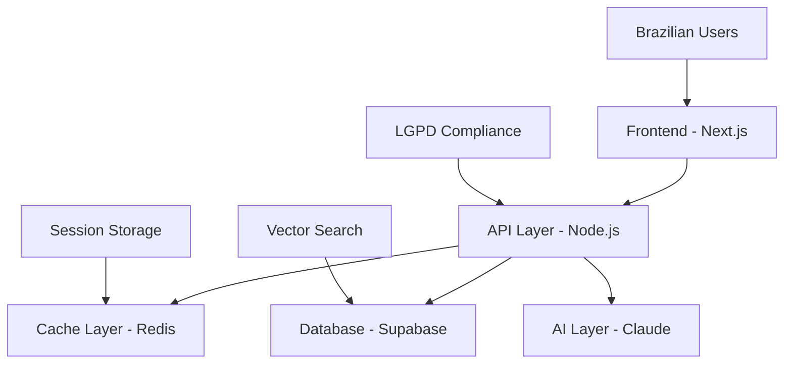

# Claude + Supabase + Redis Architecture Patterns

## Overview

This document contains proven architecture patterns for Claude + Supabase + Redis stack, optimized for Brazilian market requirements and cost efficiency.

## 1. Core Architecture Patterns

### 1.1 Three-Tier Architecture


### 1.2 Request Flow Pattern
```typescript
// Optimized request flow for Brazilian users
const processUserRequest = async (userMessage: string, userId: string) => {
  // 1. Check Redis cache first (< 10ms)
  const cached = await checkCache(userMessage);
  if (cached) return cached;
  
  // 2. Get user context from Supabase (< 100ms)
  const userContext = await getUserContext(userId);
  
  // 3. Search knowledge base (< 500ms)
  const relevantDocs = await searchKnowledgeBase(userMessage);
  
  // 4. Call Claude with optimized context (1-8s)
  const response = await callClaude({
    message: userMessage,
    context: userContext,
    documents: relevantDocs
  });
  
  // 5. Cache response and return
  await cacheResponse(userMessage, response);
  return response;
};
```

## 2. Claude Integration Patterns

### 2.1 Model Selection Pattern
```typescript
const selectOptimalModel = (request: RequestContext) => {
  const complexity = analyzeComplexity(request.message);
  const userTier = request.user.subscription;
  const urgency = request.realtime;
  
  // Cost optimization for Brazilian market
  if (complexity <= 3 || userTier === 'free') {
    return 'claude-3-haiku-20240307'; // ~R$ 0.15 per interaction
  }
  
  if (complexity <= 7 && !urgency) {
    return 'claude-3-sonnet-20240229'; // ~R$ 0.45 per interaction
  }
  
  return 'claude-3-opus-20240229'; // ~R$ 1.20 per interaction
};
```

### 2.2 Prompt Optimization Pattern
```typescript
const optimizedPromptPattern = {
  // Efficient system prompt for Portuguese
  systemPrompt: `Você é um assistente virtual brasileiro especializado.
  Responda de forma concisa mas completa em português brasileiro.
  Use máximo 300 palavras. Seja direto e útil.`,
  
  // Context compression
  compressContext: (context: string) => {
    return context
      .split('\n')
      .filter(line => line.trim().length > 10)
      .slice(0, 20) // Limit context lines
      .join('\n');
  },
  
  // Token-efficient formatting
  formatForClaude: (userMessage: string, context: string) => {
    return `Contexto: ${context.substring(0, 1000)}
    
Pergunta: ${userMessage}

Resposta em português brasileiro (máx 300 palavras):`;
  }
};
```

### 2.3 Error Handling & Fallback Pattern
```typescript
const claudeWithFallback = async (prompt: string) => {
  try {
    return await anthropic.messages.create({
      model: 'claude-3-sonnet-20240229',
      messages: [{ role: 'user', content: prompt }],
      max_tokens: 1000,
      timeout: 30000 // 30s timeout for Brazilian connectivity
    });
  } catch (error) {
    if (error.status === 429) {
      // Rate limit - use cache or wait
      await delay(exponentialBackoff(error.retryAfter));
      return claudeWithFallback(prompt);
    }
    
    if (error.status >= 500) {
      // Claude unavailable - fallback strategy
      return await fallbackResponse(prompt);
    }
    
    throw error;
  }
};

const fallbackResponse = async (prompt: string) => {
  // 1. Try cached similar response
  const similar = await findSimilarCachedResponse(prompt);
  if (similar) return adaptCachedResponse(similar, prompt);
  
  // 2. Use simpler model
  try {
    return await callHaikuModel(prompt);
  } catch {
    // 3. Static response based on intent
    return generateStaticResponse(detectIntent(prompt));
  }
};
```

## 3. Supabase Patterns

### 3.1 Efficient Schema Pattern
```sql
-- Optimized for Brazilian AI applications
CREATE TABLE conversations (
  id UUID PRIMARY KEY DEFAULT gen_random_uuid(),
  user_id UUID REFERENCES auth.users(id),
  title VARCHAR(100),
  created_at TIMESTAMP WITH TIME ZONE DEFAULT NOW(),
  updated_at TIMESTAMP WITH TIME ZONE DEFAULT NOW(),
  metadata JSONB DEFAULT '{}',
  
  -- Brazilian localization
  timezone VARCHAR(50) DEFAULT 'America/Sao_Paulo',
  language VARCHAR(10) DEFAULT 'pt-BR'
);

-- Partitioned by month for Brazilian data retention
CREATE TABLE messages (
  id UUID PRIMARY KEY DEFAULT gen_random_uuid(),
  conversation_id UUID REFERENCES conversations(id),
  role VARCHAR(20) NOT NULL, -- user, assistant, system
  content TEXT NOT NULL,
  tokens_used INTEGER,
  model_used VARCHAR(50),
  cost_brl DECIMAL(10,4), -- Track costs in Brazilian Real
  created_at TIMESTAMP WITH TIME ZONE DEFAULT NOW(),
  
  -- LGPD compliance fields
  contains_pii BOOLEAN DEFAULT FALSE,
  anonymized BOOLEAN DEFAULT FALSE,
  retention_until TIMESTAMP WITH TIME ZONE
) PARTITION BY RANGE (created_at);

-- Monthly partitions for efficient data management
CREATE TABLE messages_2024_01 PARTITION OF messages
  FOR VALUES FROM ('2024-01-01') TO ('2024-02-01');
```

### 3.2 Vector Search Pattern
```typescript
const vectorSearchPattern = {
  // Optimized for Portuguese content
  searchDocuments: async (query: string, filters?: SearchFilters) => {
    const embedding = await generateEmbedding(
      preprocessPortugueseText(query)
    );
    
    return await supabase.rpc('semantic_search_br', {
      query_embedding: embedding,
      match_threshold: 0.7,
      match_count: 10,
      language_filter: 'pt-BR',
      region_filter: filters?.region || 'brasil'
    });
  },
  
  // Hybrid search for better recall
  hybridSearch: async (query: string) => {
    const [semantic, keyword] = await Promise.all([
      vectorSearchPattern.searchDocuments(query),
      keywordSearch(query)
    ]);
    
    return rerank(semantic, keyword, query);
  }
};

-- PostgreSQL function for Brazilian semantic search
CREATE OR REPLACE FUNCTION semantic_search_br(
  query_embedding vector(1536),
  match_threshold float DEFAULT 0.7,
  match_count int DEFAULT 10,
  language_filter text DEFAULT 'pt-BR',
  region_filter text DEFAULT 'brasil'
)
RETURNS TABLE(
  id uuid,
  content text,
  similarity float,
  metadata jsonb
)
LANGUAGE plpgsql
AS $$
BEGIN
  RETURN QUERY
  SELECT
    kb.id,
    kb.content,
    (kb.embedding <=> query_embedding) * -1 + 1 AS similarity,
    kb.metadata
  FROM knowledge_base kb
  WHERE 
    (kb.embedding <=> query_embedding) < (1 - match_threshold)
    AND kb.language = language_filter
    AND (kb.metadata->>'region')::text = region_filter
  ORDER BY kb.embedding <=> query_embedding
  LIMIT match_count;
END;
$$;
```

### 3.3 Real-time Updates Pattern
```typescript
const realtimePattern = {
  // Efficient real-time for Brazilian users
  setupRealtimeSubscription: (conversationId: string) => {
    return supabase
      .channel(`conversation:${conversationId}`)
      .on('postgres_changes', {
        event: 'INSERT',
        schema: 'public',
        table: 'messages',
        filter: `conversation_id=eq.${conversationId}`
      }, (payload) => {
        handleNewMessage(payload.new);
      })
      .subscribe();
  },
  
  // Batched updates for cost efficiency
  batchInsertMessages: async (messages: Message[]) => {
    const batches = chunk(messages, 100);
    
    for (const batch of batches) {
      await supabase.from('messages').insert(batch);
      await delay(100); // Respect rate limits
    }
  }
};
```

## 4. Redis Caching Patterns

### 4.1 Multi-Layer Caching Pattern
```typescript
const cachingStrategy = {
  // L1: Response cache (1 hour)
  cacheResponse: async (key: string, response: any) => {
    await redis.setex(`response:${key}`, 3600, JSON.stringify(response));
  },
  
  // L2: User context cache (30 minutes)  
  cacheUserContext: async (userId: string, context: any) => {
    await redis.setex(`context:${userId}`, 1800, JSON.stringify(context));
  },
  
  // L3: Embeddings cache (24 hours)
  cacheEmbedding: async (text: string, embedding: number[]) => {
    const key = `embedding:${createHash(text)}`;
    await redis.setex(key, 86400, JSON.stringify(embedding));
  },
  
  // Brazilian-specific session cache
  cacheSession: async (sessionId: string, data: any) => {
    await redis.setex(`session:br:${sessionId}`, 7200, JSON.stringify({
      ...data,
      timezone: 'America/Sao_Paulo',
      language: 'pt-BR',
      currency: 'BRL'
    }));
  }
};
```

### 4.2 Smart Invalidation Pattern
```typescript
const smartInvalidation = {
  // Invalidate related caches
  invalidateUserCaches: async (userId: string) => {
    const pattern = `*:${userId}:*`;
    const keys = await redis.keys(pattern);
    
    if (keys.length > 0) {
      await redis.del(...keys);
    }
  },
  
  // Conditional cache warming
  warmCache: async (userId: string) => {
    const userProfile = await getUserProfile(userId);
    
    // Pre-cache common responses for this user type
    const commonQueries = getCommonQueries(userProfile.segment);
    
    for (const query of commonQueries) {
      if (!await redis.exists(`response:${query}`)) {
        const response = await generateResponse(query, userId);
        await cachingStrategy.cacheResponse(query, response);
      }
    }
  }
};
```

### 4.3 Cost-Aware Caching Pattern
```typescript
const costAwareCaching = {
  // Cache expensive Claude responses longer
  adaptiveTTL: (model: string, tokens: number) => {
    const baseTTL = 3600; // 1 hour
    
    if (model.includes('opus')) {
      return baseTTL * 4; // 4 hours for expensive model
    }
    
    if (tokens > 2000) {
      return baseTTL * 2; // 2 hours for long responses
    }
    
    return baseTTL;
  },
  
  // Brazilian business hours consideration
  getBrazilianTTL: () => {
    const now = new Date();
    const brazilTime = new Date(now.toLocaleString("en-US", {
      timeZone: "America/Sao_Paulo"
    }));
    
    const hour = brazilTime.getHours();
    
    // Longer cache during off-hours (20h-8h)
    if (hour >= 20 || hour <= 8) {
      return 7200; // 2 hours
    }
    
    // Shorter cache during business hours
    return 1800; // 30 minutes
  }
};
```

## 5. Performance Optimization Patterns

### 5.1 Connection Pool Pattern
```typescript
const connectionPooling = {
  // Optimized for Brazilian latency
  supabasePool: {
    min: 5,
    max: 20,
    acquireTimeoutMillis: 30000,
    idleTimeoutMillis: 600000, // 10 minutes
    reapIntervalMillis: 1000,
    createRetryIntervalMillis: 200
  },
  
  redisPool: {
    min: 2,
    max: 10,
    acquireTimeoutMillis: 10000,
    testOnBorrow: true,
    testOnReturn: false,
    pingCommand: 'PING'
  },
  
  // Health check pattern
  healthCheck: async () => {
    const [supabaseHealth, redisHealth, claudeHealth] = await Promise.all([
      checkSupabaseHealth(),
      checkRedisHealth(), 
      checkClaudeHealth()
    ]);
    
    return {
      status: all([supabaseHealth, redisHealth, claudeHealth]) ? 'healthy' : 'degraded',
      services: { supabaseHealth, redisHealth, claudeHealth },
      timestamp: new Date().toISOString(),
      region: 'brazil'
    };
  }
};
```

### 5.2 Batch Processing Pattern
```typescript
const batchProcessing = {
  // Batch Claude requests for cost efficiency
  batchClaudeRequests: async (requests: ClaudeRequest[]) => {
    const batches = chunk(requests, 5); // Process 5 at a time
    const results = [];
    
    for (const batch of batches) {
      const batchResults = await Promise.all(
        batch.map(req => processClaudeRequest(req))
      );
      results.push(...batchResults);
      
      // Respect Brazilian rate limits
      await delay(1000);
    }
    
    return results;
  },
  
  // Batch embeddings generation
  batchEmbeddings: async (texts: string[]) => {
    const batches = chunk(texts, 100);
    const embeddings = [];
    
    for (const batch of batches) {
      const response = await openai.embeddings.create({
        model: 'text-embedding-ada-002',
        input: batch.map(preprocessPortugueseText)
      });
      
      embeddings.push(...response.data.map(e => e.embedding));
    }
    
    return embeddings;
  }
};
```

## 6. Brazilian Market Optimizations

### 6.1 Regional Performance Pattern
```typescript
const brazilianOptimizations = {
  // CDN configuration for Brazil
  cdnConfig: {
    regions: ['sa-east-1'], // São Paulo
    fallback: ['us-east-1'], // North Virginia
    cacheTTL: {
      static: 86400, // 24 hours
      api: 300, // 5 minutes
      dynamic: 60 // 1 minute
    }
  },
  
  // Database read replicas
  databaseRouting: (query: QueryType) => {
    if (query.readonly && query.region === 'brazil') {
      return 'supabase-sao-paulo-read-replica';
    }
    return 'supabase-primary';
  },
  
  // Network optimization
  networkOptimization: {
    compression: 'gzip',
    keepAlive: true,
    timeout: 30000, // 30s for Brazilian connectivity
    retries: 3,
    retryDelay: 1000
  }
};
```

### 6.2 Cost Optimization Pattern
```typescript
const costOptimization = {
  // Daily cost tracking in BRL
  trackDailyCosts: async (costs: CostBreakdown) => {
    const brlRate = await getBRLExchangeRate();
    
    await supabase.from('daily_costs').insert({
      date: new Date().toISOString().split('T')[0],
      claude_usd: costs.claude,
      claude_brl: costs.claude * brlRate,
      supabase_usd: costs.supabase,
      supabase_brl: costs.supabase * brlRate,
      redis_usd: costs.redis,
      redis_brl: costs.redis * brlRate,
      total_brl: (costs.claude + costs.supabase + costs.redis) * brlRate
    });
  },
  
  // Budget-aware request routing
  budgetAwareRouting: async (request: Request) => {
    const dailySpend = await getDailySpend();
    const budget = await getDailyBudget();
    
    if (dailySpend > budget * 0.9) {
      // Near budget limit - use cheaper options
      return {
        model: 'claude-3-haiku-20240307',
        cacheFirst: true,
        maxTokens: 500
      };
    }
    
    return standardRouting(request);
  }
};
```

## 7. Security & LGPD Patterns

### 7.1 Data Protection Pattern
```typescript
const dataProtection = {
  // Automatic PII detection and anonymization
  anonymizeForAI: (content: string) => {
    return content
      .replace(/\b\d{3}\.\d{3}\.\d{3}-\d{2}\b/g, '[CPF]')
      .replace(/\b\d{2}\.\d{3}\.\d{3}\/\d{4}-\d{2}\b/g, '[CNPJ]')
      .replace(/\b[A-Za-z0-9._%+-]+@[A-Za-z0-9.-]+\.[A-Z|a-z]{2,}\b/g, '[EMAIL]')
      .replace(/\b\d{2}\s?\d{4,5}-?\d{4}\b/g, '[TELEFONE]');
  },
  
  // Audit trail for LGPD compliance
  auditDataAccess: async (operation: DataOperation) => {
    await supabase.from('data_access_log').insert({
      user_id: operation.userId,
      operation_type: operation.type,
      data_categories: operation.categories,
      legal_basis: operation.legalBasis,
      purpose: operation.purpose,
      timestamp: new Date(),
      ip_address: operation.ip,
      user_agent: operation.userAgent
    });
  }
};
```

## 8. Monitoring & Alerting Patterns

### 8.1 Brazilian-Specific Monitoring
```typescript
const monitoringPatterns = {
  // Cost alerts in BRL
  costAlerting: async () => {
    const dailyCosts = await getDailyCostsBRL();
    const budget = await getDailyBudgetBRL();
    
    if (dailyCosts > budget * 0.8) {
      await sendAlert({
        type: 'cost_warning',
        message: `Custo diário em R$ ${dailyCosts.toFixed(2)} (${(dailyCosts/budget*100).toFixed(1)}% do orçamento)`,
        severity: dailyCosts > budget ? 'critical' : 'warning'
      });
    }
  },
  
  // Performance monitoring for Brazilian users
  performanceMonitoring: {
    trackLatency: async (operation: string, duration: number, region: string) => {
      await supabase.from('performance_metrics').insert({
        operation,
        duration_ms: duration,
        region,
        timestamp: new Date(),
        brazil_business_hours: isBrazilBusinessHours()
      });
    }
  }
};
```

## Usage Guidelines

1. **Start with caching**: Implement Redis caching first for immediate performance gains
2. **Monitor costs daily**: Track Claude API usage in BRL for budget control
3. **Optimize for mobile**: Brazilian users primarily use mobile devices
4. **LGPD compliance**: Always anonymize PII before sending to Claude
5. **Regional hosting**: Use São Paulo region for lowest latency
6. **Graceful degradation**: Always have fallback strategies for API failures

## Performance Targets

- **Database queries**: < 100ms average
- **Redis cache hits**: > 70%
- **Claude API calls**: < 5 seconds average
- **Total response time**: < 3 seconds for Brazilian users
- **Cost per interaction**: < R$ 0.50 average
- **Uptime**: > 99.9% 