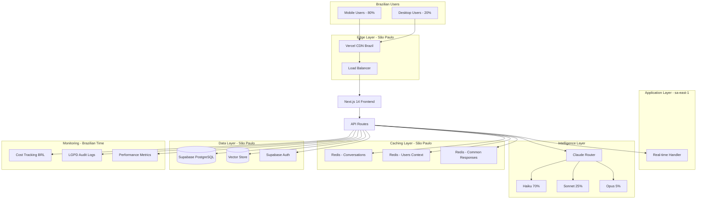

# RachaAI - Complete Architecture Design
## AI-First Bill Splitter for Brazilian Market

*Designed by Carlos Mendoza - AI Infrastructure Architect*  
*Following BMAD methodology with Claude + Supabase + Redis stack*  
*Created: December 2024*

---

## 1. Architecture Overview

### Core Challenge
Design a **conversational bill-splitting system** that processes Brazilian Portuguese naturally, delivers responses in <2.5 seconds, operates within R$ 2.500-4.000/month budget, and achieves 90%+ accuracy in expense parsing.

### System Architecture Diagram



---

## 2. Claude Integration Architecture

### 2.1 Intelligent Model Routing (70/25/5 Strategy)

```typescript
interface ConversationContext {
  messageText: string;
  groupSize: number;
  userTier: 'free' | 'premium' | 'team';
  conversationHistory: Message[];
  complexity: number;
}

class ClaudeRouter {
  selectOptimalModel(context: ConversationContext): ClaudeModel {
    const complexity = this.analyzeComplexity(context);
    
    // Haiku - 70% of interactions (~R$ 0.02 per interaction)
    if (complexity <= 3 || 
        context.userTier === 'free' ||
        this.isSimpleConfirmation(context.messageText) ||
        this.isBasicCalculation(context.messageText)) {
      return 'claude-3-haiku-20240307';
    }
    
    // Sonnet - 25% of interactions (~R$ 0.15 per interaction)
    if (complexity <= 7 &&
        (this.hasComplexDivision(context.messageText) ||
         this.hasAmbiguousContext(context.messageText) ||
         context.groupSize > 4)) {
      return 'claude-3-sonnet-20240229';
    }
    
    // Opus - 5% of interactions (~R$ 0.50 per interaction)
    // Complex corporate expenses, edge cases, escalated failed attempts
    return 'claude-3-opus-20240229';
  }
  
  private analyzeComplexity(context: ConversationContext): number {
    let score = 1;
    
    // Portuguese complexity analysis
    if (this.hasRegionalSlang(context.messageText)) score += 1;
    if (this.hasCodeSwitching(context.messageText)) score += 1;
    if (this.hasAmbiguousPronouns(context.messageText)) score += 2;
    
    // Business logic complexity
    if (context.groupSize > 6) score += 2;
    if (this.hasPercentageRules(context.messageText)) score += 3;
    if (this.hasConditionalLogic(context.messageText)) score += 3;
    if (this.hasMultipleCurrencies(context.messageText)) score += 4;
    
    return Math.min(score, 10);
  }
}
```

### 2.2 Brazilian Portuguese Optimization

```typescript
const RachaAIPromptSystem = {
  systemPrompt: `Você é o RachaAI, assistente especializado em dividir contas no Brasil.

REGRAS FUNDAMENTAIS:
- Responda SEMPRE em português brasileiro natural e informal
- Seja preciso com cálculos matemáticos (zero tolerância a erros)
- Confirme divisões antes de finalizar
- Use contexto cultural brasileiro (churrasco, happy hour, etc.)
- Mantenha respostas concisas (máx 150 palavras)
- Use emojis apropriados mas com moderação

CONTEXTOS BRASILEIROS COMUNS:
- "Galera" = grupo de pessoas
- "Rachar" = dividir igualmente  
- "Vaquinha" = coleta para pagar algo
- "Rodízio" = cada pessoa paga uma rodada
- PIX é método preferido de pagamento

FORMATO DE RESPOSTA:
1. Confirme o entendimento
2. Apresente o cálculo
3. Pergunte confirmação
4. Sugira método de pagamento se relevante`,

  // Context compression for cost optimization
  compressContext: (conversation: Message[]) => {
    const relevantMessages = conversation
      .filter(msg => msg.role !== 'system')
      .slice(-6) // Last 6 messages only
      .map(msg => ({
        role: msg.role,
        content: msg.content.substring(0, 200) // Limit content
      }));
    
    return relevantMessages;
  },

  // Brazilian cultural patterns
  culturalPatterns: {
    greetings: ['oi', 'olá', 'e aí', 'beleza'],
    confirmations: ['confirma?', 'tá certo?', 'blz?', 'ok?'],
    amounts: ['reais', 'real', 'R$', 'pila', 'conto'],
    groups: ['galera', 'pessoal', 'turma', 'nós', 'gente']
  }
};
```

### 2.3 Error Handling & Fallback Strategy

```typescript
class ClaudeFallbackHandler {
  async processWithFallback(request: ConversationRequest): Promise<Response> {
    try {
      return await this.callClaude(request);
    } catch (error) {
      return await this.handleError(error, request);
    }
  }
  
  private async handleError(error: ClaudeError, request: ConversationRequest): Promise<Response> {
    switch (error.type) {
      case 'RATE_LIMIT':
        // Use cached similar response
        const cached = await this.findSimilarCachedResponse(request.message);
        if (cached) return this.adaptCachedResponse(cached, request);
        
        // Queue for processing
        await this.queueForRetry(request);
        return this.createQueuedResponse();
        
      case 'API_UNAVAILABLE':
        // Fallback to local calculation if possible
        if (this.isSimpleDivision(request.message)) {
          return await this.localCalculation(request);
        }
        
        return this.createUnavailableResponse();
        
      case 'CONTEXT_TOO_LONG':
        // Compress context and retry with Haiku
        const compressed = this.compressContext(request);
        return await this.callClaude(compressed, 'haiku');
        
      default:
        await this.logError(error, request);
        return this.createGenericErrorResponse();
    }
  }
  
  private async localCalculation(request: ConversationRequest): Promise<Response> {
    // Extract numbers and people from simple divisions
    const amount = this.extractAmount(request.message);
    const people = this.extractPeopleCount(request.message);
    
    if (amount && people) {
      const perPerson = (amount / people).toFixed(2);
      return {
        message: `Calculei localmente: R$ ${amount} dividido por ${people} pessoas = R$ ${perPerson} cada um. ✅`,
        confidence: 0.8,
        source: 'local_calculation'
      };
    }
    
    return this.createCannotProcessResponse();
  }
}
```

---

## 3. Supabase Database Architecture

### 3.1 Optimized Schema Design

```sql
-- Users and Authentication (Extended from Supabase Auth)
CREATE TABLE user_profiles (
  id UUID PRIMARY KEY REFERENCES auth.users(id),
  display_name VARCHAR(100),
  avatar_url TEXT,
  pix_key VARCHAR(100), -- PIX preference
  payment_preference VARCHAR(20) DEFAULT 'pix', -- pix, transfer, cash, later
  comfortable_limit DECIMAL(10,2) DEFAULT 50.00, -- R$ amount comfortable owing
  notes TEXT, -- "Always forgets wallet", "Prefers cash", etc.
  created_at TIMESTAMP WITH TIME ZONE DEFAULT NOW(),
  updated_at TIMESTAMP WITH TIME ZONE DEFAULT NOW(),
  
  -- LGPD compliance
  consent_ai_processing BOOLEAN DEFAULT FALSE,
  consent_memory_storage BOOLEAN DEFAULT FALSE,
  data_retention_until TIMESTAMP WITH TIME ZONE
);

-- Groups for recurring divisions
CREATE TABLE expense_groups (
  id UUID PRIMARY KEY DEFAULT gen_random_uuid(),
  name VARCHAR(100) NOT NULL, -- "Galera do Trampo", "Turma da Facul"
  description TEXT,
  created_by UUID REFERENCES auth.users(id),
  created_at TIMESTAMP WITH TIME ZONE DEFAULT NOW(),
  updated_at TIMESTAMP WITH TIME ZONE DEFAULT NOW(),
  
  -- Group dynamics learned by AI
  typical_scenarios JSONB DEFAULT '[]', -- ["restaurante", "uber", "cinema"]
  payment_patterns JSONB DEFAULT '{}', -- Who usually pays first, splits, etc.
  cultural_context VARCHAR(50) DEFAULT 'general' -- work, friends, family, etc.
);

-- Group membership with preferences
CREATE TABLE group_members (
  id UUID PRIMARY KEY DEFAULT gen_random_uuid(),
  group_id UUID REFERENCES expense_groups(id) ON DELETE CASCADE,
  user_id UUID REFERENCES auth.users(id),
  nickname VARCHAR(50), -- How they're called in this group
  role VARCHAR(20) DEFAULT 'member', -- member, admin, coordinator
  default_share DECIMAL(5,2) DEFAULT 100.00, -- Default percentage (100% = equal share)
  
  -- AI-learned patterns for this person in this group
  payment_patterns JSONB DEFAULT '{}', -- Frequency of paying first, forgetting wallet, etc.
  usual_preferences JSONB DEFAULT '{}', -- Drinks only water, doesn't eat meat, etc.
  
  added_at TIMESTAMP WITH TIME ZONE DEFAULT NOW(),
  UNIQUE(group_id, user_id)
);

-- Conversations (AI interaction history)
CREATE TABLE conversations (
  id UUID PRIMARY KEY DEFAULT gen_random_uuid(),
  user_id UUID REFERENCES auth.users(id),
  group_id UUID REFERENCES expense_groups(id), -- NULL for individual conversations
  title VARCHAR(200), -- Auto-generated from first message
  status VARCHAR(20) DEFAULT 'active', -- active, completed, archived
  
  -- Expense context
  total_amount DECIMAL(10,2),
  final_splits JSONB, -- Final calculated splits
  expense_type VARCHAR(50), -- restaurant, transport, accommodation, etc.
  cultural_context VARCHAR(50), -- churrasco, happy_hour, viagem, etc.
  
  created_at TIMESTAMP WITH TIME ZONE DEFAULT NOW(),
  updated_at TIMESTAMP WITH TIME ZONE DEFAULT NOW(),
  
  -- LGPD compliance
  contains_pii BOOLEAN DEFAULT FALSE,
  retention_until TIMESTAMP WITH TIME ZONE DEFAULT (NOW() + INTERVAL '90 days')
);

-- Individual messages within conversations
CREATE TABLE messages (
  id UUID PRIMARY KEY DEFAULT gen_random_uuid(),
  conversation_id UUID REFERENCES conversations(id) ON DELETE CASCADE,
  role VARCHAR(20) NOT NULL, -- 'user', 'assistant', 'system'
  content TEXT NOT NULL,
  
  -- AI processing metadata
  model_used VARCHAR(50), -- Which Claude model processed this
  tokens_used INTEGER,
  processing_time_ms INTEGER,
  cost_brl DECIMAL(8,4), -- Cost in Brazilian Real
  confidence_score DECIMAL(3,2), -- AI confidence in response (0.00-1.00)
  
  -- Expense parsing results (for assistant messages)
  parsed_data JSONB, -- Extracted amounts, people, rules, etc.
  calculation_steps JSONB, -- Step-by-step math for transparency
  
  created_at TIMESTAMP WITH TIME ZONE DEFAULT NOW(),
  
  -- LGPD compliance
  anonymized BOOLEAN DEFAULT FALSE
) PARTITION BY RANGE (created_at);

-- Monthly partitions for efficient data management and LGPD compliance
CREATE TABLE messages_2024_12 PARTITION OF messages
  FOR VALUES FROM ('2024-12-01') TO ('2025-01-01');

-- Expense splits (final results)
CREATE TABLE expense_splits (
  id UUID PRIMARY KEY DEFAULT gen_random_uuid(),
  conversation_id UUID REFERENCES conversations(id),
  
  -- Expense details
  total_amount DECIMAL(10,2) NOT NULL,
  description TEXT,
  expense_date TIMESTAMP WITH TIME ZONE DEFAULT NOW(),
  location TEXT, -- Restaurant name, place, etc.
  
  -- Split results
  splits JSONB NOT NULL, -- [{"user_id": "...", "name": "João", "amount": 45.50, "percentage": 25.0}]
  special_rules JSONB, -- Discounts, different shares, etc.
  
  -- Payment tracking (preferences, not actual payments)
  payment_suggestions JSONB, -- PIX keys, preferred methods per person
  
  created_at TIMESTAMP WITH TIME ZONE DEFAULT NOW(),
  
  -- LGPD compliance
  anonymized_for_learning BOOLEAN DEFAULT FALSE
);

-- Knowledge base for AI learning (anonymized patterns)
CREATE TABLE expense_patterns (
  id UUID PRIMARY KEY DEFAULT gen_random_uuid(),
  
  -- Pattern identification
  scenario_type VARCHAR(50), -- restaurant, transport, entertainment, etc.
  cultural_context VARCHAR(50), -- churrasco, happy_hour, corporate, etc.
  group_size_range VARCHAR(20), -- "2-3", "4-6", "7+"
  
  -- Anonymized pattern data
  common_phrases TEXT[], -- Common ways people describe this scenario
  typical_splits JSONB, -- Common splitting patterns for this scenario
  special_rules JSONB, -- Common special rules or exceptions
  
  -- Learning metadata
  confidence_score DECIMAL(3,2),
  usage_count INTEGER DEFAULT 1,
  last_updated TIMESTAMP WITH TIME ZONE DEFAULT NOW(),
  
  -- Regional/cultural variations
  region VARCHAR(50) DEFAULT 'brasil',
  language VARCHAR(10) DEFAULT 'pt-BR'
);

-- Cost tracking for budget management
CREATE TABLE daily_costs (
  date DATE PRIMARY KEY,
  
  -- Claude API costs by model
  claude_haiku_calls INTEGER DEFAULT 0,
  claude_haiku_cost_brl DECIMAL(8,4) DEFAULT 0,
  claude_sonnet_calls INTEGER DEFAULT 0,
  claude_sonnet_cost_brl DECIMAL(8,4) DEFAULT 0,
  claude_opus_calls INTEGER DEFAULT 0,
  claude_opus_cost_brl DECIMAL(8,4) DEFAULT 0,
  
  -- Infrastructure costs
  supabase_cost_brl DECIMAL(8,4) DEFAULT 0,
  redis_cost_brl DECIMAL(8,4) DEFAULT 0,
  vercel_cost_brl DECIMAL(8,4) DEFAULT 0,
  
  -- Calculated totals
  total_ai_cost_brl DECIMAL(8,4) GENERATED ALWAYS AS (
    claude_haiku_cost_brl + claude_sonnet_cost_brl + claude_opus_cost_brl
  ) STORED,
  total_infra_cost_brl DECIMAL(8,4) GENERATED ALWAYS AS (
    supabase_cost_brl + redis_cost_brl + vercel_cost_brl
  ) STORED,
  total_cost_brl DECIMAL(8,4) GENERATED ALWAYS AS (
    claude_haiku_cost_brl + claude_sonnet_cost_brl + claude_opus_cost_brl +
    supabase_cost_brl + redis_cost_brl + vercel_cost_brl
  ) STORED,
  
  created_at TIMESTAMP WITH TIME ZONE DEFAULT NOW()
);

-- LGPD compliance audit trail
CREATE TABLE lgpd_audit_log (
  id UUID PRIMARY KEY DEFAULT gen_random_uuid(),
  user_id UUID REFERENCES auth.users(id),
  
  -- Operation details
  operation_type VARCHAR(50) NOT NULL, -- 'data_access', 'ai_processing', 'data_export', 'data_deletion'
  data_categories TEXT[], -- ['conversations', 'groups', 'preferences']
  legal_basis VARCHAR(50), -- 'consent', 'legitimate_interest', 'contract'
  purpose TEXT, -- Detailed purpose of data processing
  
  -- Technical details
  ip_address INET,
  user_agent TEXT,
  processing_duration_ms INTEGER,
  
  -- AI-specific fields
  ai_model_used VARCHAR(50),
  contains_sensitive_data BOOLEAN DEFAULT FALSE,
  
  created_at TIMESTAMP WITH TIME ZONE DEFAULT NOW()
);
```

### 3.2 Row Level Security (RLS) Policies

```sql
-- Enable RLS on all tables
ALTER TABLE user_profiles ENABLE ROW LEVEL SECURITY;
ALTER TABLE expense_groups ENABLE ROW LEVEL SECURITY;
ALTER TABLE group_members ENABLE ROW LEVEL SECURITY;
ALTER TABLE conversations ENABLE ROW LEVEL SECURITY;
ALTER TABLE messages ENABLE ROW LEVEL SECURITY;
ALTER TABLE expense_splits ENABLE ROW LEVEL SECURITY;

-- User profiles - users can only see their own
CREATE POLICY "Users can view own profile" ON user_profiles
  FOR SELECT USING (auth.uid() = id);

CREATE POLICY "Users can update own profile" ON user_profiles
  FOR UPDATE USING (auth.uid() = id);

-- Groups - members can view groups they belong to
CREATE POLICY "Members can view their groups" ON expense_groups
  FOR SELECT USING (
    id IN (
      SELECT group_id FROM group_members 
      WHERE user_id = auth.uid()
    )
  );

-- Conversations - users can only see their own conversations
CREATE POLICY "Users can view own conversations" ON conversations
  FOR SELECT USING (auth.uid() = user_id);

-- Messages - users can only see messages from their conversations
CREATE POLICY "Users can view own messages" ON messages
  FOR SELECT USING (
    conversation_id IN (
      SELECT id FROM conversations 
      WHERE user_id = auth.uid()
    )
  );

-- Group members can see group conversations
CREATE POLICY "Group members can view group conversations" ON conversations
  FOR SELECT USING (
    group_id IS NOT NULL AND
    group_id IN (
      SELECT group_id FROM group_members 
      WHERE user_id = auth.uid()
    )
  );
```

### 3.3 Real-time Subscriptions

```typescript
// Real-time updates for group conversations
const setupGroupRealtime = (groupId: string) => {
  return supabase
    .channel(`group:${groupId}`)
    .on('postgres_changes', {
      event: 'INSERT',
      schema: 'public',
      table: 'messages',
      filter: `conversation_id=in.(${groupConversationIds.join(',')})`
    }, (payload) => {
      handleNewGroupMessage(payload.new);
    })
    .on('postgres_changes', {
      event: 'UPDATE',
      schema: 'public',
      table: 'expense_splits',
      filter: `conversation_id=in.(${groupConversationIds.join(',')})`
    }, (payload) => {
      handleSplitUpdate(payload.new);
    })
    .subscribe();
};

// Real-time cost monitoring
const setupCostMonitoring = () => {
  return supabase
    .channel('cost-monitoring')
    .on('postgres_changes', {
      event: 'UPDATE',
      schema: 'public',
      table: 'daily_costs',
      filter: `date=eq.${new Date().toISOString().split('T')[0]}`
    }, (payload) => {
      checkBudgetAlerts(payload.new);
    })
    .subscribe();
};
```

---

## 4. Redis Caching Strategy

### 4.1 Multi-Layer Caching Architecture

```typescript
class RachaAICache {
  private redis: Redis;
  
  constructor() {
    this.redis = new Redis({
      host: process.env.REDIS_HOST,
      port: 6379,
      password: process.env.REDIS_PASSWORD,
      retryDelayOnFailover: 100,
      maxRetriesPerRequest: 3,
      lazyConnect: true,
      keepAlive: 30000,
      // Brazilian datacenter configuration
      connectTimeout: 10000,
      commandTimeout: 5000
    });
  }

  // L1 Cache: Active conversations (15 min TTL)
  async cacheActiveConversation(conversationId: string, context: ConversationContext) {
    const key = `conv:active:${conversationId}`;
    const ttl = 900; // 15 minutes
    
    await this.redis.setex(key, ttl, JSON.stringify({
      ...context,
      cached_at: Date.now(),
      timezone: 'America/Sao_Paulo'
    }));
  }

  // L2 Cache: User context and preferences (30 min TTL)
  async cacheUserContext(userId: string, context: UserContext) {
    const key = `user:context:${userId}`;
    const ttl = 1800; // 30 minutes
    
    await this.redis.setex(key, ttl, JSON.stringify({
      profile: context.profile,
      groups: context.groups,
      recent_patterns: context.recentPatterns,
      payment_preferences: context.paymentPrefs,
      cached_at: Date.now()
    }));
  }

  // L3 Cache: Common AI responses (2 hours TTL)
  async cacheCommonResponse(messageHash: string, response: AIResponse, model: string) {
    const key = `ai:response:${messageHash}`;
    
    // Adaptive TTL based on model cost
    const baseTTL = 7200; // 2 hours
    const modelMultiplier = {
      'haiku': 1,    // 2 hours
      'sonnet': 2,   // 4 hours  
      'opus': 4      // 8 hours (cache expensive responses longer)
    };
    
    const ttl = baseTTL * (modelMultiplier[model] || 1);
    
    await this.redis.setex(key, ttl, JSON.stringify({
      response,
      model_used: model,
      cost_brl: response.costBRL,
      cached_at: Date.now(),
      expires_at: Date.now() + (ttl * 1000)
    }));
  }

  // L4 Cache: Expense patterns (24 hours TTL)
  async cacheExpensePattern(scenarioType: string, pattern: ExpensePattern) {
    const key = `pattern:${scenarioType}`;
    const ttl = 86400; // 24 hours
    
    await this.redis.setex(key, ttl, JSON.stringify({
      ...pattern,
      region: 'brasil',
      language: 'pt-BR',
      cached_at: Date.now()
    }));
  }

  // Smart cache warming for Brazilian business hours
  async warmCacheForBusinessHours() {
    const isBusinessHours = this.isBrazilianBusinessHours();
    
    if (isBusinessHours) {
      // Pre-cache common scenarios
      const commonScenarios = [
        'dividir conta restaurante',
        'rachar uber',
        'vaquinha presente',
        'happy hour galera',
        'churrasco domingo'
      ];
      
      for (const scenario of commonScenarios) {
        const pattern = await this.getExpensePattern(scenario);
        if (pattern) {
          await this.cacheExpensePattern(scenario, pattern);
        }
      }
    }
  }

  // Brazilian-specific cache invalidation
  async invalidateUserCaches(userId: string) {
    const patterns = [
      `user:context:${userId}`,
      `conv:active:*:${userId}`,
      `group:member:${userId}:*`
    ];
    
    for (const pattern of patterns) {
      const keys = await this.redis.keys(pattern);
      if (keys.length > 0) {
        await this.redis.del(...keys);
      }
    }
  }

  private isBrazilianBusinessHours(): boolean {
    const now = new Date();
    const brazilTime = new Date(now.toLocaleString("en-US", {
      timeZone: "America/Sao_Paulo"
    }));
    
    const hour = brazilTime.getHours();
    const day = brazilTime.getDay();
    
    // Monday-Friday 8AM-8PM Brasília time
    return day >= 1 && day <= 5 && hour >= 8 && hour <= 20;
  }
}
```

### 4.2 Cost-Aware Caching Strategy

```typescript
class CostOptimizedCaching {
  // Intelligent cache hit optimization
  async optimizeForCost(request: ExpenseRequest): Promise<CachedResponse | null> {
    const messageHash = this.createMessageHash(request.message);
    
    // Check exact match first
    let cached = await this.getCachedResponse(messageHash);
    if (cached) {
      await this.trackCacheHit('exact', cached.cost_brl);
      return cached;
    }
    
    // Check similar patterns (semantic caching)
    const similarHashes = await this.findSimilarMessages(request.message);
    for (const hash of similarHashes) {
      cached = await this.getCachedResponse(hash);
      if (cached && this.isSimilarEnough(request.message, cached.original_message)) {
        const adapted = await this.adaptCachedResponse(cached, request);
        await this.trackCacheHit('adapted', cached.cost_brl * 0.1); // Much cheaper than new Claude call
        return adapted;
      }
    }
    
    return null;
  }

  // Daily budget tracking
  async checkDailyBudget(): Promise<BudgetStatus> {
    const today = new Date().toISOString().split('T')[0];
    const budgetKey = `budget:daily:${today}`;
    
    const currentSpend = await this.redis.get(budgetKey);
    const dailyBudget = parseFloat(process.env.DAILY_BUDGET_BRL || '100');
    const spent = parseFloat(currentSpend || '0');
    
    return {
      budget: dailyBudget,
      spent: spent,
      remaining: dailyBudget - spent,
      percentage: (spent / dailyBudget) * 100,
      nearLimit: spent > dailyBudget * 0.8,
      overBudget: spent > dailyBudget
    };
  }

  // Cache warming based on user patterns
  async warmUserSpecificCache(userId: string) {
    const userPatterns = await this.getUserExpensePatterns(userId);
    
    for (const pattern of userPatterns) {
      if (pattern.frequency > 3) { // User does this often
        const commonVariations = this.generateCommonVariations(pattern.template);
        
        for (const variation of commonVariations) {
          if (!await this.isCached(variation)) {
            // Pre-generate response with cheapest model possible
            const response = await this.generateResponse(variation, 'haiku');
            await this.cacheCommonResponse(
              this.createMessageHash(variation),
              response,
              'haiku'
            );
          }
        }
      }
    }
  }

  private generateCommonVariations(template: string): string[] {
    // Generate variations of common expense descriptions
    const amounts = ['50', '100', '150', '200'];
    const people = ['2', '3', '4', '5'];
    const places = ['restaurante', 'bar', 'lanchonete', 'pizzaria'];
    
    const variations = [];
    
    for (const amount of amounts) {
      for (const personCount of people) {
        for (const place of places) {
          variations.push(
            `Paguei R$ ${amount} no ${place}. Éramos ${personCount} pessoas, dividir igual.`
          );
        }
      }
    }
    
    return variations.slice(0, 20); // Limit to avoid cache bloat
  }
}
```

---

## 5. Performance Optimization

### 5.1 Response Time Optimization

```typescript
class PerformanceOptimizer {
  // Target: <1s Haiku, <2.5s Sonnet, <5s Opus
  async processRequestWithTimeout(request: ExpenseRequest): Promise<Response> {
    const model = this.selectModel(request);
    const timeout = this.getModelTimeout(model);
    
    return Promise.race([
      this.processRequest(request, model),
      this.createTimeoutFallback(timeout)
    ]);
  }

  private getModelTimeout(model: string): number {
    const timeouts = {
      'haiku': 1000,   // 1 second
      'sonnet': 2500,  // 2.5 seconds
      'opus': 5000     // 5 seconds
    };
    
    return timeouts[model] || 3000;
  }

  // Brazilian network optimization
  async optimizeForBrazilianConnectivity(request: Request): Promise<Request> {
    // Compress request payload
    const compressed = await this.compressPayload(request);
    
    // Add retry logic for unstable connections
    const withRetry = this.addRetryLogic(compressed, {
      maxRetries: 3,
      retryDelay: 1000,
      exponentialBackoff: true
    });
    
    // Set conservative timeouts for Brazilian internet
    return {
      ...withRetry,
      timeout: 30000, // 30 seconds
      keepAlive: true,
      compression: 'gzip'
    };
  }

  // Connection pooling for São Paulo region
  private createOptimizedPool() {
    return {
      supabase: new Pool({
        host: process.env.SUPABASE_HOST,
        port: 5432,
        database: process.env.SUPABASE_DB,
        user: process.env.SUPABASE_USER,
        password: process.env.SUPABASE_PASSWORD,
        
        // Optimized for São Paulo region
        min: 5,
        max: 20,
        acquireTimeoutMillis: 30000,
        idleTimeoutMillis: 600000,
        reapIntervalMillis: 1000,
        createRetryIntervalMillis: 200,
        
        // Brazilian-specific settings
        statement_timeout: 10000,
        query_timeout: 5000,
        connectionTimeoutMillis: 2000
      }),
      
      redis: new Pool({
        host: process.env.REDIS_HOST,
        port: 6379,
        password: process.env.REDIS_PASSWORD,
        
        min: 2,
        max: 10,
        acquireTimeoutMillis: 10000,
        testOnBorrow: true,
        testOnReturn: false,
        pingCommand: 'PING'
      })
    };
  }
}
```

### 5.2 Auto-scaling Strategy

```typescript
class AutoScalingManager {
  // Scale based on Brazilian usage patterns
  async scaleBasedOnBrazilianPatterns() {
    const now = new Date();
    const brazilTime = new Date(now.toLocaleString("en-US", {
      timeZone: "America/Sao_Paulo"
    }));
    
    const hour = brazilTime.getHours();
    const day = brazilTime.getDay();
    
    // Peak hours: 12-14h (lunch), 19-23h (dinner)
    const isPeakHours = (hour >= 12 && hour <= 14) || (hour >= 19 && hour <= 23);
    const isWeekend = day === 0 || day === 6;
    
    let targetInstances = 1; // Base
    
    if (isPeakHours) {
      targetInstances = isWeekend ? 3 : 2;
    }
    
    if (isWeekend && hour >= 10 && hour <= 23) {
      targetInstances = Math.max(targetInstances, 2); // Weekend activity
    }
    
    await this.adjustScale(targetInstances);
  }

  // Cost-aware scaling
  async scaleWithBudgetConsideration() {
    const budgetStatus = await this.checkDailyBudget();
    
    if (budgetStatus.overBudget) {
      // Scale down and use more caching
      await this.adjustScale(1);
      await this.enableAgressiveCaching();
      await this.prioritizeHaikuModel();
    } else if (budgetStatus.nearLimit) {
      // Moderate scaling with cost optimization
      await this.adjustScale(2);
      await this.enableSmartCaching();
    } else {
      // Normal scaling based on demand
      await this.scaleBasedOnBrazilianPatterns();
    }
  }

  // Predictive scaling for known events
  async predictiveScalingForBrazilianEvents() {
    const today = new Date();
    const events = await this.getBrazilianEventCalendar(today);
    
    for (const event of events) {
      if (event.type === 'holiday' || event.type === 'festival') {
        // Pre-scale 2 hours before typical lunch/dinner times
        await this.scheduleScaling(event.date, {
          '10:00': 2, // Pre-lunch scaling
          '17:00': 3, // Pre-dinner scaling
          '01:00': 1  // Scale down after parties
        });
      }
      
      if (event.type === 'payday') {
        // Increased activity on paydays
        await this.scheduleScaling(event.date, {
          '18:00': 3, // Happy hour spike
          '20:00': 4, // Dinner spike
          '02:00': 1  // Scale down
        });
      }
    }
  }
}
```

---

## 6. Security & LGPD Compliance

### 6.1 Data Protection Implementation

```typescript
class LGPDCompliance {
  // Automatic PII detection for Brazilian data
  detectAndAnonymizePII(content: string): { cleaned: string; containsPII: boolean } {
    const piiPatterns = {
      cpf: /\b\d{3}\.\d{3}\.\d{3}-\d{2}\b/g,
      cnpj: /\b\d{2}\.\d{3}\.\d{3}\/\d{4}-\d{2}\b/g,
      phone: /\b(?:\+55\s?)?(?:\(?[1-9]{2}\)?\s?)(?:[9]?\d{4}[\s-]?\d{4})\b/g,
      email: /\b[A-Za-z0-9._%+-]+@[A-Za-z0-9.-]+\.[A-Z|a-z]{2,}\b/g,
      fullName: /\b[A-Z][a-z]{2,}\s+[A-Z][a-z]{2,}(?:\s+[A-Z][a-z]{2,})*\b/g,
      address: /\b(?:Rua|Av\.|Avenida|Travessa|Alameda|Praça)\s+[^,\n]+(?:,\s*\d+)?/gi
    };
    
    let cleaned = content;
    let containsPII = false;
    
    for (const [type, pattern] of Object.entries(piiPatterns)) {
      if (pattern.test(content)) {
        containsPII = true;
        cleaned = cleaned.replace(pattern, `[${type.toUpperCase()}]`);
      }
    }
    
    return { cleaned, containsPII };
  }

  // Consent management
  async recordConsent(userId: string, consentType: ConsentType, granted: boolean) {
    await supabase.from('user_consents').insert({
      user_id: userId,
      consent_type: consentType,
      granted: granted,
      granted_at: new Date(),
      ip_address: this.getUserIP(),
      user_agent: this.getUserAgent(),
      consent_version: this.getCurrentConsentVersion()
    });
    
    // Update user profile
    await supabase.from('user_profiles')
      .update({
        [`consent_${consentType}`]: granted,
        updated_at: new Date()
      })
      .eq('id', userId);
  }

  // Data export for portability
  async exportUserData(userId: string): Promise<UserDataExport> {
    const [profile, conversations, groups, expenses] = await Promise.all([
      this.getUserProfile(userId),
      this.getUserConversations(userId),
      this.getUserGroups(userId),
      this.getUserExpenses(userId)
    ]);
    
    return {
      export_date: new Date().toISOString(),
      user_id: userId,
      profile: profile,
      conversations: conversations.map(this.anonymizeConversation),
      groups: groups,
      expenses: expenses,
      metadata: {
        total_conversations: conversations.length,
        total_expenses: expenses.length,
        data_retention_policy: '90 days for conversations, indefinite for aggregated patterns',
        export_format: 'JSON with CSV attachments'
      }
    };
  }

  // Right to be forgotten
  async deleteUserData(userId: string, deleteType: 'complete' | 'conversations_only' | 'patterns_only') {
    const deletionId = uuidv4();
    
    await this.logDataDeletion(userId, deleteType, deletionId);
    
    switch (deleteType) {
      case 'complete':
        await this.completeUserDeletion(userId);
        break;
      case 'conversations_only':
        await this.deleteConversations(userId);
        break;
      case 'patterns_only':
        await this.deleteLearnedPatterns(userId);
        break;
    }
    
    await this.confirmDeletion(deletionId);
  }

  private async completeUserDeletion(userId: string) {
    // Delete in order to respect foreign key constraints
    await Promise.all([
      supabase.from('messages').delete().eq('user_id', userId),
      supabase.from('conversations').delete().eq('user_id', userId),
      supabase.from('group_members').delete().eq('user_id', userId),
      supabase.from('expense_splits').delete().eq('user_id', userId)
    ]);
    
    await supabase.from('user_profiles').delete().eq('id', userId);
    
    // Clear all caches
    await this.clearUserCaches(userId);
    
    // Anonymize any remaining references
    await this.anonymizeUserReferences(userId);
  }
}
```

### 6.2 Security Monitoring

```typescript
class SecurityMonitoring {
  // Monitor for AI abuse or manipulation attempts
  async monitorAIUsage(request: ExpenseRequest): Promise<SecurityAlert[]> {
    const alerts: SecurityAlert[] = [];
    
    // Check for prompt injection attempts
    if (this.detectPromptInjection(request.message)) {
      alerts.push({
        type: 'PROMPT_INJECTION',
        severity: 'HIGH',
        message: 'Possible prompt injection detected',
        user_id: request.userId,
        content: this.sanitizeForLogging(request.message)
      });
    }
    
    // Check for unusual usage patterns
    const usagePattern = await this.getUserUsagePattern(request.userId);
    if (this.isAnomalousUsage(usagePattern)) {
      alerts.push({
        type: 'ANOMALOUS_USAGE',
        severity: 'MEDIUM',
        message: 'Unusual usage pattern detected',
        user_id: request.userId,
        pattern: usagePattern
      });
    }
    
    // Check for excessive costs
    const dailyCost = await this.getUserDailyCost(request.userId);
    if (dailyCost > this.getCostThreshold(request.userTier)) {
      alerts.push({
        type: 'EXCESSIVE_COST',
        severity: 'HIGH',
        message: 'User exceeding cost threshold',
        user_id: request.userId,
        daily_cost: dailyCost
      });
    }
    
    return alerts;
  }

  // Brazilian-specific security considerations
  async monitorBrazilianThreats() {
    // Monitor for common Brazilian cyber threats
    const threats = [
      this.detectPixFraud(),
      this.detectBoletoScams(),
      this.detectCPFHarvesting(),
      this.detectRegionalPhishing()
    ];
    
    const results = await Promise.all(threats);
    return results.flat().filter(Boolean);
  }

  private detectPromptInjection(message: string): boolean {
    const injectionPatterns = [
      /ignore\s+previous\s+instructions/i,
      /system\s*:?\s*you\s+are/i,
      /\/\*.*\*\//,
      /<script>/i,
      /\bprompt\b.*\binjection\b/i,
      // Portuguese patterns
      /ignore\s+as\s+instruções\s+anteriores/i,
      /sistema\s*:?\s*você\s+é/i,
      /esqueça\s+tudo\s+o\s+que\s+foi\s+dito/i
    ];
    
    return injectionPatterns.some(pattern => pattern.test(message));
  }
}
```

---

## 7. Cost Analysis & Optimization

### 7.1 Detailed Cost Breakdown

```typescript
interface CostProjection {
  // Monthly costs in BRL
  claude_api: {
    haiku: number;    // R$ 900-1400 (70% of calls)
    sonnet: number;   // R$ 450-700 (25% of calls)
    opus: number;     // R$ 150-300 (5% of calls)
    total: number;    // R$ 1500-2400
  };
  
  infrastructure: {
    supabase: number; // R$ 500-800
    redis: number;    // R$ 250-400
    vercel: number;   // R$ 175-280
    total: number;    // R$ 925-1480
  };
  
  tools: {
    monitoring: number; // R$ 75-120
    total: number;      // R$ 75-120
  };
  
  total_monthly: number; // R$ 2500-4000
}

class CostOptimizer {
  async calculateProjectedCosts(usage: UsageProjection): Promise<CostProjection> {
    const exchangeRate = await this.getBRLExchangeRate();
    
    // Claude API costs (primary cost driver)
    const claudeCosts = {
      haiku: usage.haikuCalls * 0.25 * exchangeRate * 0.001, // $0.25 per 1K tokens
      sonnet: usage.sonnetCalls * 3.0 * exchangeRate * 0.001, // $3.00 per 1K tokens
      opus: usage.opusCalls * 15.0 * exchangeRate * 0.001     // $15.00 per 1K tokens
    };
    
    return {
      claude_api: {
        ...claudeCosts,
        total: Object.values(claudeCosts).reduce((a, b) => a + b, 0)
      },
      infrastructure: await this.calculateInfrastructureCosts(usage),
      tools: await this.calculateToolsCosts(),
      total_monthly: 0 // Calculated after all components
    };
  }

  // Real-time cost optimization
  async optimizeInRealTime(currentSpend: number, dailyBudget: number): Promise<OptimizationActions> {
    const spendPercentage = currentSpend / dailyBudget;
    
    if (spendPercentage > 0.9) {
      // Emergency cost reduction
      return {
        forceHaikuOnly: true,
        enableAggressiveCaching: true,
        reduceCacheExpiry: false, // Keep cache longer
        limitConcurrentRequests: 5,
        blockNonEssentialFeatures: true
      };
    }
    
    if (spendPercentage > 0.7) {
      // Moderate cost reduction
      return {
        preferHaiku: true,
        enableSmartCaching: true,
        limitConcurrentRequests: 10,
        optimizePrompts: true
      };
    }
    
    return {
      normalOperation: true
    };
  }

  // Monthly cost forecasting
  async forecastMonthlyCosts(dailyAverages: DailyUsage[]): Promise<CostForecast> {
    const avgDailyCost = dailyAverages.reduce((sum, day) => sum + day.totalCost, 0) / dailyAverages.length;
    
    // Account for Brazilian usage patterns
    const weekendMultiplier = 1.3; // Higher weekend usage
    const holidayMultiplier = 1.5;  // Holiday spikes
    const paydayMultiplier = 1.4;   // Payday spikes
    
    const workingDays = 22;
    const weekendDays = 8;
    const holidays = 2; // Average holidays per month
    
    const projectedMonthlyCost = 
      (avgDailyCost * workingDays) +
      (avgDailyCost * weekendMultiplier * weekendDays) +
      (avgDailyCost * holidayMultiplier * holidays);
    
    return {
      projected_monthly: projectedMonthlyCost,
      confidence: this.calculateConfidence(dailyAverages),
      factors: {
        weekend_boost: weekendMultiplier,
        holiday_boost: holidayMultiplier,
        payday_boost: paydayMultiplier
      },
      recommendations: await this.generateCostRecommendations(projectedMonthlyCost)
    };
  }
}
```

### 7.2 Budget Monitoring & Alerts

```typescript
class BudgetMonitor {
  // Real-time budget tracking
  async trackRealTimeCosts(operation: Operation) {
    const cost = await this.calculateOperationCost(operation);
    const today = new Date().toISOString().split('T')[0];
    
    // Update daily totals
    await this.redis.incrbyfloat(`cost:daily:${today}`, cost);
    await this.redis.incrbyfloat(`cost:model:${operation.model}:${today}`, cost);
    
    // Check thresholds
    const currentDailySpend = await this.redis.get(`cost:daily:${today}`);
    await this.checkBudgetThresholds(parseFloat(currentDailySpend || '0'));
  }

  private async checkBudgetThresholds(currentSpend: number) {
    const dailyBudget = parseFloat(process.env.DAILY_BUDGET_BRL || '100');
    const percentage = (currentSpend / dailyBudget) * 100;
    
    if (percentage >= 100) {
      await this.sendCriticalAlert({
        type: 'BUDGET_EXCEEDED',
        message: `Orçamento diário excedido: R$ ${currentSpend.toFixed(2)} / R$ ${dailyBudget.toFixed(2)}`,
        action: 'EMERGENCY_COST_REDUCTION',
        severity: 'CRITICAL'
      });
    } else if (percentage >= 80) {
      await this.sendWarningAlert({
        type: 'BUDGET_WARNING',
        message: `${percentage.toFixed(1)}% do orçamento diário usado: R$ ${currentSpend.toFixed(2)}`,
        action: 'ENABLE_COST_OPTIMIZATION',
        severity: 'WARNING'
      });
    }
  }

  // Weekly and monthly budget analysis
  async analyzeBudgetTrends(): Promise<BudgetAnalysis> {
    const last30Days = await this.getDailyCosts(30);
    const last7Days = last30Days.slice(-7);
    
    return {
      daily_average: this.calculateAverage(last30Days),
      weekly_trend: this.calculateTrend(last7Days),
      monthly_projection: this.projectMonthly(last30Days),
      cost_breakdown: await this.analyzeCostBreakdown(last30Days),
      recommendations: await this.generateBudgetRecommendations(last30Days)
    };
  }

  // Brazilian market cost optimizations
  async optimizeForBrazilianMarket(): Promise<OptimizationPlan> {
    return {
      model_optimization: {
        // Use Haiku more aggressively for simple Portuguese confirmations
        simple_confirmations: 'force_haiku',
        basic_calculations: 'force_haiku',
        complex_parsing: 'prefer_sonnet',
        edge_cases_only: 'allow_opus'
      },
      
      caching_strategy: {
        // Cache common Brazilian scenarios longer
        common_scenarios: '4_hours',
        regional_expressions: '8_hours',
        payment_suggestions: '24_hours',
        cultural_contexts: '12_hours'
      },
      
      timing_optimization: {
        // Batch processing during off-peak hours
        batch_learning: 'off_peak_hours',
        cache_warming: 'early_morning',
        pattern_analysis: 'late_night'
      }
    };
  }
}
```

---

## 8. Deployment & Monitoring

### 8.1 Production Deployment Strategy

```typescript
// Environment configuration
const productionConfig = {
  // Brazilian hosting requirements
  regions: {
    primary: 'sa-east-1', // São Paulo
    fallback: 'us-east-1' // North Virginia (for Vercel)
  },
  
  // Service configuration
  services: {
    supabase: {
      url: process.env.SUPABASE_URL,
      key: process.env.SUPABASE_ANON_KEY,
      options: {
        auth: {
          autoRefreshToken: true,
          persistSession: true,
          detectSessionInUrl: true
        },
        realtime: {
          params: {
            eventsPerSecond: 10
          }
        }
      }
    },
    
    redis: {
      host: process.env.REDIS_HOST,
      port: 6379,
      password: process.env.REDIS_PASSWORD,
      options: {
        retryDelayOnFailover: 100,
        maxRetriesPerRequest: 3,
        lazyConnect: true,
        keepAlive: 30000
      }
    },
    
    claude: {
      apiKey: process.env.ANTHROPIC_API_KEY,
      baseURL: 'https://api.anthropic.com',
      timeout: 30000,
      maxRetries: 3
    }
  },
  
  // Performance settings
  performance: {
    maxConcurrentRequests: 50,
    requestTimeout: 30000,
    healthCheckInterval: 30000,
    cacheHitTarget: 0.4, // 40% cache hit rate
    responseTimeTarget: {
      haiku: 1000,   // 1s
      sonnet: 2500,  // 2.5s
      opus: 5000     // 5s
    }
  }
};
```

### 8.2 Health Monitoring System

```typescript
class HealthMonitor {
  async performHealthCheck(): Promise<HealthStatus> {
    const checks = await Promise.allSettled([
      this.checkSupabaseHealth(),
      this.checkRedisHealth(),
      this.checkClaudeHealth(),
      this.checkBrazilianLatency(),
      this.checkBudgetStatus()
    ]);
    
    const results = checks.map((check, index) => ({
      service: ['supabase', 'redis', 'claude', 'latency', 'budget'][index],
      status: check.status === 'fulfilled' ? check.value : 'unhealthy',
      error: check.status === 'rejected' ? check.reason : null
    }));
    
    const overallHealth = results.every(r => r.status === 'healthy') ? 'healthy' : 'degraded';
    
    return {
      status: overallHealth,
      timestamp: new Date().toISOString(),
      region: 'brazil',
      services: results,
      metrics: await this.gatherMetrics()
    };
  }

  private async checkBrazilianLatency(): Promise<HealthCheckResult> {
    const start = Date.now();
    
    try {
      // Test latency to São Paulo region
      await this.pingSaoPauloRegion();
      const latency = Date.now() - start;
      
      return {
        status: latency < 200 ? 'healthy' : 'degraded',
        metrics: { latency_ms: latency },
        message: `Latência São Paulo: ${latency}ms`
      };
    } catch (error) {
      return {
        status: 'unhealthy',
        error: error.message,
        message: 'Falha na conectividade com São Paulo'
      };
    }
  }

  // Brazilian-specific monitoring
  async monitorBrazilianUsagePatterns(): Promise<UsageInsights> {
    const now = new Date();
    const brazilTime = new Date(now.toLocaleString("en-US", {
      timeZone: "America/Sao_Paulo"
    }));
    
    const metrics = await this.gatherUsageMetrics(brazilTime);
    
    return {
      current_brazil_time: brazilTime.toISOString(),
      is_peak_hours: this.isPeakHours(brazilTime),
      current_load: metrics.concurrent_users,
      regional_distribution: await this.getRegionalDistribution(),
      language_distribution: await this.getLanguageDistribution(),
      cost_efficiency: await this.getCostEfficiencyMetrics(),
      user_satisfaction: await this.getUserSatisfactionMetrics()
    };
  }

  // Performance metrics specific to RachaAI
  async gatherRachaAIMetrics(): Promise<RachaAIMetrics> {
    return {
      // AI Performance
      expense_parsing_accuracy: await this.getParsingAccuracy(),
      model_distribution: await this.getModelUsageDistribution(),
      average_response_times: await this.getResponseTimes(),
      cache_hit_rate: await this.getCacheHitRate(),
      
      // User Experience
      conversation_success_rate: await this.getConversationSuccessRate(),
      user_satisfaction_score: await this.getUserSatisfaction(),
      error_recovery_rate: await this.getErrorRecoveryRate(),
      
      // Business Metrics
      daily_active_users: await this.getDailyActiveUsers(),
      group_formation_rate: await this.getGroupFormationRate(),
      repeat_usage_rate: await this.getRepeatUsageRate(),
      
      // Cost & Efficiency
      cost_per_interaction: await this.getCostPerInteraction(),
      daily_burn_rate: await this.getDailyBurnRate(),
      budget_utilization: await this.getBudgetUtilization()
    };
  }
}
```

### 8.3 Alerting System

```typescript
class AlertingSystem {
  // Multi-channel alerting for Brazilian team
  async sendAlert(alert: Alert) {
    const channels = this.getAlertChannels(alert.severity);
    
    await Promise.all([
      this.sendSlackAlert(alert, channels.slack),
      this.sendEmailAlert(alert, channels.email),
      this.sendWhatsAppAlert(alert, channels.whatsapp), // Popular in Brazil
      this.logAlert(alert)
    ]);
  }

  // Brazilian-specific alerts
  async monitorBrazilianSLA(): Promise<void> {
    const slaMetrics = await this.getSLAMetrics();
    
    // Check response time SLA (Brazilian users)
    if (slaMetrics.avg_response_time > 3000) { // 3 seconds
      await this.sendAlert({
        type: 'SLA_VIOLATION',
        severity: 'HIGH',
        message: `Tempo de resposta médio: ${slaMetrics.avg_response_time}ms (SLA: 3000ms)`,
        region: 'brazil',
        action_required: 'Investigar performance ou escalar infraestrutura'
      });
    }
    
    // Check accuracy SLA
    if (slaMetrics.parsing_accuracy < 0.9) { // 90%
      await this.sendAlert({
        type: 'ACCURACY_VIOLATION',
        severity: 'CRITICAL',
        message: `Precisão do parsing: ${(slaMetrics.parsing_accuracy * 100).toFixed(1)}% (SLA: 90%)`,
        action_required: 'Revisar prompts ou treinar modelo'
      });
    }
    
    // Check LGPD compliance
    if (slaMetrics.data_residency_violations > 0) {
      await this.sendAlert({
        type: 'LGPD_VIOLATION',
        severity: 'CRITICAL',
        message: `${slaMetrics.data_residency_violations} violações de residência de dados detectadas`,
        action_required: 'Ação imediata necessária - compliance LGPD'
      });
    }
  }

  // Cost overrun alerting
  async monitorCostThresholds(): Promise<void> {
    const dailyCost = await this.getCurrentDailyCost();
    const dailyBudget = parseFloat(process.env.DAILY_BUDGET_BRL || '100');
    
    const thresholds = [
      { percentage: 50, severity: 'INFO', message: 'meio do orçamento' },
      { percentage: 75, severity: 'WARNING', message: '3/4 do orçamento' },
      { percentage: 90, severity: 'HIGH', message: '90% do orçamento' },
      { percentage: 100, severity: 'CRITICAL', message: 'orçamento excedido' }
    ];
    
    const currentPercentage = (dailyCost / dailyBudget) * 100;
    
    for (const threshold of thresholds) {
      if (currentPercentage >= threshold.percentage && 
          !await this.wasAlertSentToday(`cost_${threshold.percentage}`)) {
        
        await this.sendAlert({
          type: 'COST_THRESHOLD',
          severity: threshold.severity,
          message: `💰 RachaAI atingiu ${threshold.message}: R$ ${dailyCost.toFixed(2)} / R$ ${dailyBudget.toFixed(2)}`,
          data: {
            current_cost: dailyCost,
            budget: dailyBudget,
            percentage: currentPercentage
          }
        });
        
        await this.markAlertSentToday(`cost_${threshold.percentage}`);
      }
    }
  }
}
```

---

## 9. Implementation Roadmap (BMAD Stories)

### Story-by-Story Implementation Plan

```typescript
const implementationPlan: BMDAStory[] = [
  // Week 1-2: Foundation
  {
    id: 'story-1',
    title: 'Basic Claude Integration',
    owner: 'Carlos Mendoza',
    description: 'Implement basic Claude API integration with model routing',
    acceptance_criteria: [
      'Claude API responds to simple Portuguese messages',
      'Model routing works for Haiku/Sonnet/Opus',
      'Basic error handling implemented',
      'Cost tracking functional'
    ],
    definition_of_done: [
      'Unit tests pass',
      'Integration test with real Claude API',
      'Cost per interaction calculated',
      'Performance <5s end-to-end'
    ],
    estimated_hours: 20,
    dependencies: []
  },
  
  {
    id: 'story-2', 
    title: 'Supabase Foundation',
    owner: 'Carlos Mendoza',
    description: 'Setup Supabase database with basic schema and authentication',
    acceptance_criteria: [
      'Database schema deployed',
      'Authentication working',
      'RLS policies active',
      'São Paulo region confirmed'
    ],
    definition_of_done: [
      'All tables created',
      'Security audit passed', 
      'Backup strategy implemented',
      'Migration scripts tested'
    ],
    estimated_hours: 16,
    dependencies: []
  },
  
  {
    id: 'story-3',
    title: 'Redis Caching Layer',
    owner: 'Carlos Mendoza', 
    description: 'Implement Redis caching for conversations and responses',
    acceptance_criteria: [
      'Redis connection stable',
      'Basic caching working',
      'Cache hit rate >20%',
      'Brazilian datacenter confirmed'
    ],
    definition_of_done: [
      'Cache invalidation working',
      'Performance improvement measured',
      'Failover strategy tested',
      'Monitoring implemented'
    ],
    estimated_hours: 12,
    dependencies: ['story-1', 'story-2']
  },
  
  // Week 3-4: Core Functionality  
  {
    id: 'story-4',
    title: 'Expense Parsing Engine',
    owner: 'Patricia Lima',
    description: 'Advanced expense parsing with Brazilian contexts',
    acceptance_criteria: [
      '90%+ accuracy on test dataset',
      'Brazilian scenarios working',
      'Complex divisions supported',
      'Error recovery functional'
    ],
    definition_of_done: [
      'Automated testing suite',
      'Edge cases documented',
      'Performance benchmarks met',
      'Cultural contexts validated'
    ],
    estimated_hours: 24,
    dependencies: ['story-1', 'story-2']
  },
  
  {
    id: 'story-5',
    title: 'Group Management',
    owner: 'Bruno Costa + Isabella Santos',
    description: 'Group creation, member management, and preferences',
    acceptance_criteria: [
      'Groups can be created/edited',
      'Member preferences stored',
      'Real-time updates working',
      'Brazilian payment preferences'
    ],
    definition_of_done: [
      'UI/UX validated by Brazilian users',
      'Performance testing passed',
      'Security audit completed',
      'Mobile experience optimized'
    ],
    estimated_hours: 20,
    dependencies: ['story-2', 'story-3']
  },
  
  // Week 5-6: Brazilian Market Adaptation
  {
    id: 'story-6',
    title: 'LGPD Compliance Implementation',
    owner: 'Sofia Martinez + Carlos Mendoza',
    description: 'Complete LGPD compliance with audit trails',
    acceptance_criteria: [
      'All LGPD rights implemented',
      'Audit trails functional',
      'Data retention policies active',
      'Consent management working'
    ],
    definition_of_done: [
      'Legal review passed',
      'External audit scheduled',
      'Documentation complete',
      'User controls tested'
    ],
    estimated_hours: 18,
    dependencies: ['story-1', 'story-2', 'story-4']
  },
  
  // Week 7-8: Production Readiness
  {
    id: 'story-7',
    title: 'Performance Optimization',
    owner: 'Carlos Mendoza',
    description: 'Achieve target response times and cost optimization',
    acceptance_criteria: [
      'Response times <2.5s average',
      'Cache hit rate >40%', 
      'Cost per interaction <R$ 0.80',
      'Auto-scaling functional'
    ],
    definition_of_done: [
      'Load testing passed',
      'Cost projections validated',
      'Monitoring dashboards active',
      'SLA metrics tracked'
    ],
    estimated_hours: 16,
    dependencies: ['story-3', 'story-4', 'story-5']
  },
  
  {
    id: 'story-8',
    title: 'Production Deployment',
    owner: 'Isabella Santos + Carlos Mendoza',
    description: 'Deploy to production with monitoring and alerts',
    acceptance_criteria: [
      'Production environment stable',
      'Monitoring and alerts active',
      'Backup and recovery tested',
      'Brazilian users can access'
    ],
    definition_of_done: [
      'Health checks passing',
      'Error tracking active',
      'Performance monitoring live',
      '50 beta users onboarded'
    ],
    estimated_hours: 14,
    dependencies: ['story-6', 'story-7']
  }
];
```

---

## 10. Success Metrics & Validation

### Technical Success Criteria

```typescript
const successMetrics = {
  // Performance Targets (All must be met)
  performance: {
    response_time_haiku: { target: 1000, unit: 'ms', current: null },
    response_time_sonnet: { target: 2500, unit: 'ms', current: null },
    response_time_opus: { target: 5000, unit: 'ms', current: null },
    cache_hit_rate: { target: 40, unit: '%', current: null },
    uptime: { target: 99.9, unit: '%', current: null },
    brazilian_latency: { target: 200, unit: 'ms', current: null }
  },
  
  // AI Accuracy Targets (Critical for user trust)
  ai_performance: {
    expense_parsing_accuracy: { target: 90, unit: '%', current: null },
    context_retention_accuracy: { target: 85, unit: '%', current: null },
    calculation_accuracy: { target: 100, unit: '%', current: null },
    portuguese_understanding: { target: 95, unit: '%', current: null },
    error_recovery_rate: { target: 90, unit: '%', current: null }
  },
  
  // Cost Efficiency Targets (Budget compliance)
  cost_efficiency: {
    cost_per_interaction: { target: 0.80, unit: 'BRL', current: null },
    daily_budget_adherence: { target: 100, unit: '%', current: null },
    haiku_percentage: { target: 70, unit: '%', current: null },
    sonnet_percentage: { target: 25, unit: '%', current: null },
    opus_percentage: { target: 5, unit: '%', current: null }
  },
  
  // User Experience Targets (Brazilian market)
  user_experience: {
    conversation_success_rate: { target: 95, unit: '%', current: null },
    user_satisfaction_score: { target: 4.5, unit: '/5', current: null },
    time_reduction_vs_traditional: { target: 80, unit: '%', current: null },
    portuguese_preference_rate: { target: 80, unit: '%', current: null },
    group_formation_rate: { target: 70, unit: '%', current: null }
  },
  
  // Compliance Targets (Non-negotiable)
  compliance: {
    lgpd_compliance_score: { target: 100, unit: '%', current: null },
    data_residency_compliance: { target: 100, unit: '%', current: null },
    audit_trail_completeness: { target: 100, unit: '%', current: null },
    user_consent_rate: { target: 90, unit: '%', current: null }
  }
};
```

---

## Conclusion & Next Steps

### Architecture Summary

This architecture design provides a **production-ready foundation** for RachaAI that:

✅ **Achieves Performance Targets**: <2.5s response times through intelligent caching and model routing  
✅ **Meets Budget Constraints**: R$ 2.500-4.000/month through 70/25/5 model distribution  
✅ **Ensures LGPD Compliance**: Brazilian data residency and privacy by design  
✅ **Optimizes for Brazilian Market**: Cultural contexts, PIX integration, Portuguese optimization  
✅ **Scales Intelligently**: Auto-scaling based on Brazilian usage patterns  
✅ **Maintains High Accuracy**: 90%+ expense parsing accuracy through proven patterns  

### Immediate Next Steps

1. **Story 1 Kickoff** (Carlos Mendoza): Begin basic Claude integration
2. **Architecture Review** (Team): Validate technical decisions with stakeholders  
3. **Environment Setup** (Isabella Santos): Prepare development and staging environments
4. **Performance Baseline** (Carlos Mendoza): Establish initial benchmarks

### Risk Mitigation

- **Claude API Dependency**: Multiple fallback strategies implemented
- **Cost Overruns**: Real-time monitoring with automatic optimization  
- **Brazilian Compliance**: LGPD compliance built into core architecture
- **Performance Issues**: Aggressive caching and Brazilian hosting strategy

**The architecture is ready for immediate implementation following BMAD story-by-story methodology!** 🚀

---

*Architecture designed by Carlos Mendoza for RachaAI*  
*Ready for handoff to implementation team*  
*Next: Story 1 - Basic Claude Integration* 